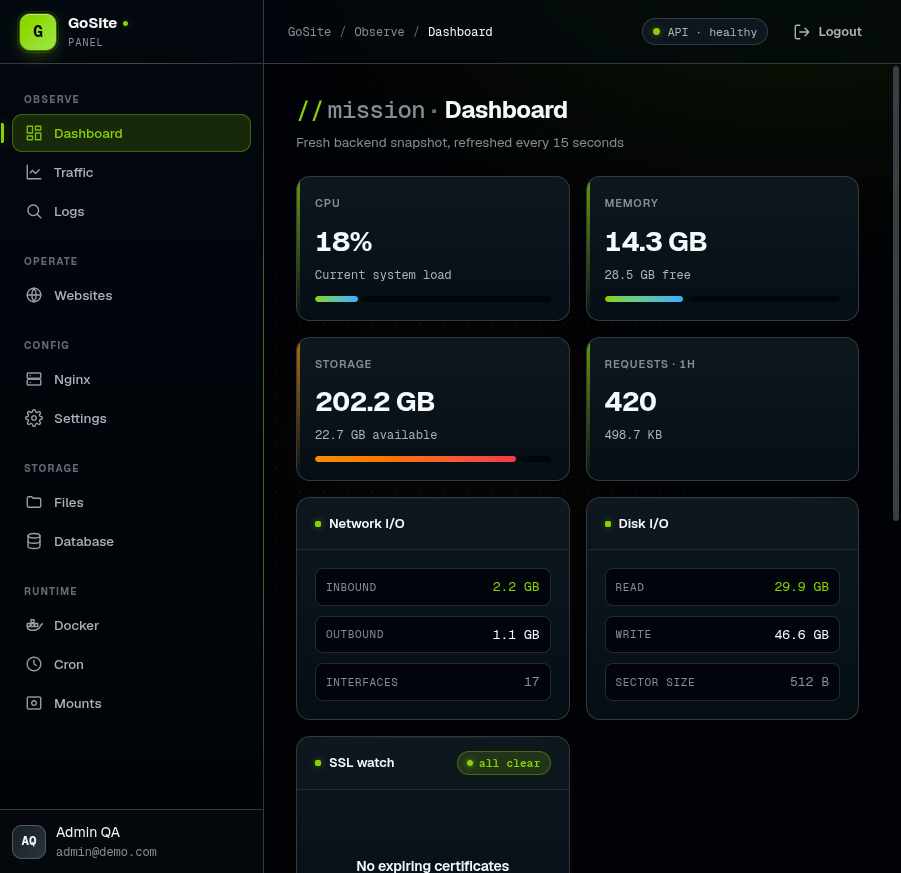
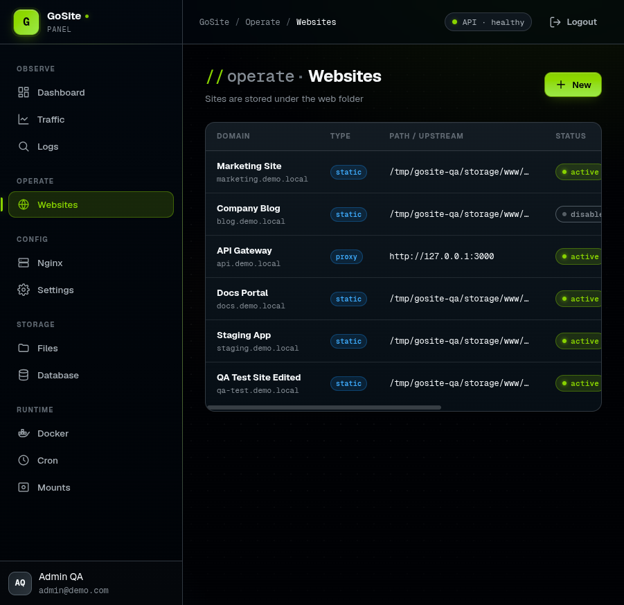
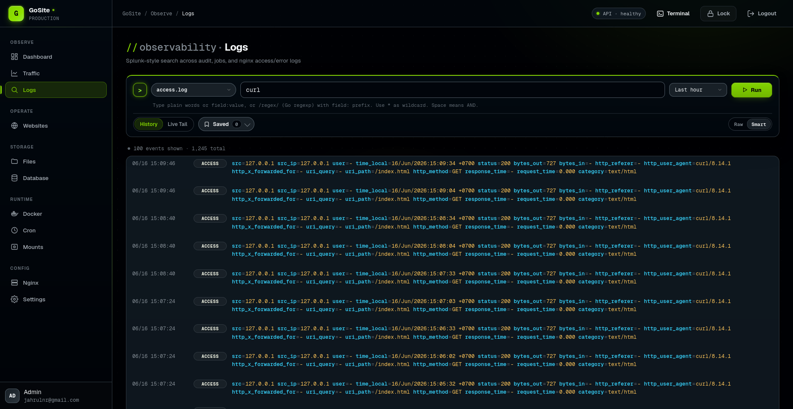
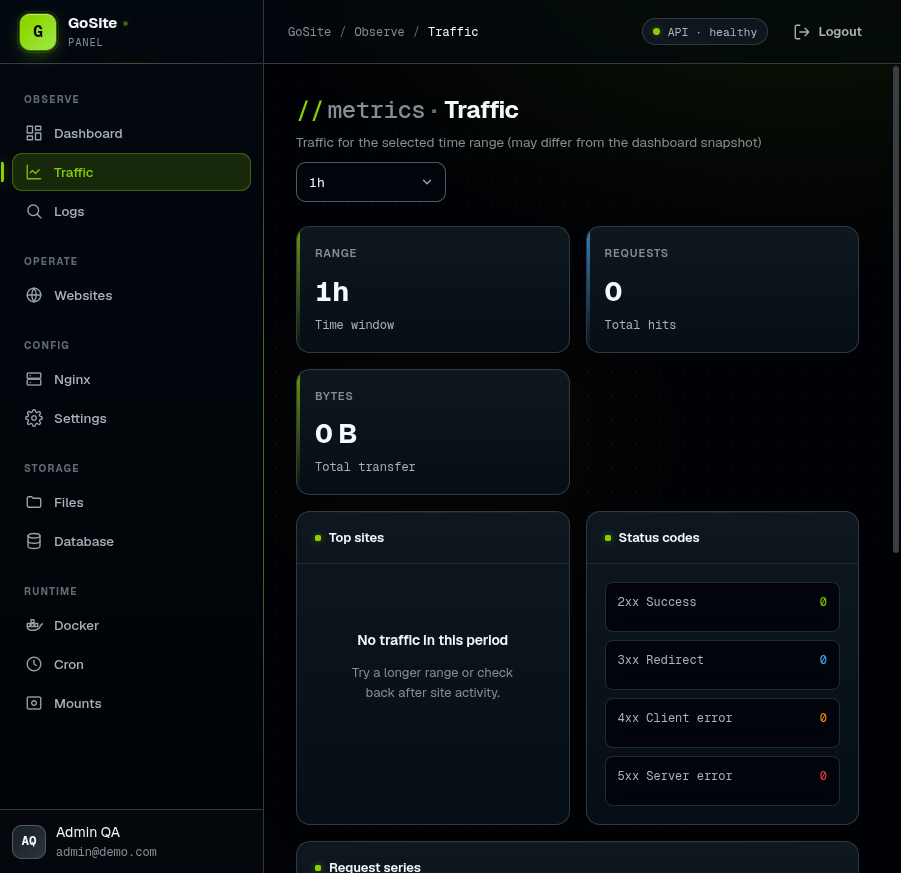
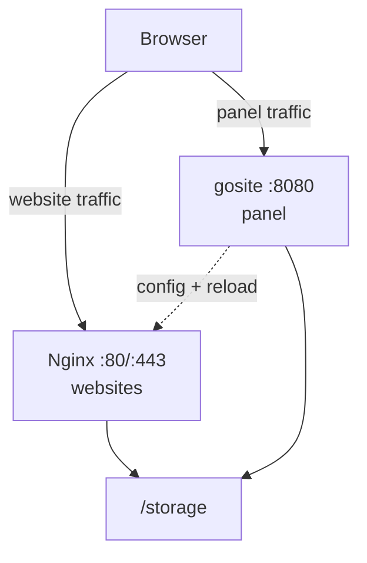

# GoSite

**Modern hosting control panel** — Go backend, Preact SPA, and Nginx edge in one container. GoSite is the successor to [BangunSite](https://github.com/jahrulnr/bangunsite) (Laravel), rebuilt as a lightweight, API-first platform for managing websites, SSL, Docker, cron jobs, and observability on a single VM.

[](https://go.dev/)
[](LICENSE)

---

## Overview

GoSite is a single Go **control plane** on `:8080` plus **nginx** on `:80/:443` for hosted websites. Certbot, Docker, and filesystem operations share the BangunSite storage layout — production vhosts stay compatible.

| Layer | Stack |
|-------|-------|
| Backend | Go 1.26, Gin, SQLite (`modernc.org/sqlite`) |
| Frontend | Preact 10, TypeScript, Vite 5 |
| Edge | Nginx 1.30, Certbot |
| Observability | Splunk Lite (audit + log query), Grafana Lite (traffic metrics) |

## Screenshots

### Dashboard — live server health & audit feed



### Websites — CRUD, enable/disable, SSL & nginx config



### Logs — Splunk-style query across access & error logs



### Traffic — per-site metrics and status-code breakdown



## Features

- **Dashboard** — CPU, RAM, disk, network I/O, SSL expiry watch, top sites, recent audit
- **Websites** — static & reverse-proxy vhosts, enable/disable via `active.d/` symlinks
- **Nginx & SSL** — edit global/default/site config, validate (dry-run), reload dengan auto-repair, Certbot (job + SSE) atau manual certs
- **Docker** — list, restart, stop containers; stream logs via `docker.sock`
- **File manager** — browse `/www` and storage roots with path validation
- **Mount manager** — fstab CRUD and mount/umount
- **Cron jobs** — schedule + manual run with SSE stream
- **Splunk Lite** — structured log ingest, saved queries, tail stream
- **Grafana Lite** — traffic time-series, top sites, status-code charts
- **Database viewer** — read-only SQLite table browser
- **Floating Terminal** — xterm.js popup launched from the topbar; persistent PTY (12h sticky, rolling 256KB dump to `/tmp`), 1 writer + N readers across tabs/devices
- **Auth** — session cookies, optional HTTP Basic gate, lockscreen

## Quick start

### Prerequisites

- Go 1.26+
- Node.js 20+ and npm
- Docker & Docker Compose (for container deploy)
- OpenSSL (dev TLS cert generation)

### Local development

Two terminals — API and frontend dev server:

```bash
# Terminal 1 — Go API on https://localhost:8080
make dev-api

# Terminal 2 — Vite dev server on http://localhost:5173 (proxies /api)
make dev-fe
```

Default demo credentials (seeded when `DEMO_SEED=true`):

| Field | Value |
|-------|-------|
| Email | `admin@demo.com` |
| Password | `123456` |

`make dev-api` sets `AUTH_ENABLE=false` and uses `/tmp/gosite-qa/storage` so you can iterate without touching production paths.

### Docker (production-like)

```bash
make up    # build image (host network for DNS) + docker compose up -d
make down
```

After `make up`, the stack exposes **two entry points**:

| Port | URL | Purpose |
|------|-----|---------|
| `http://localhost/` | nginx `:80` | Default welcome page (`/www/default`) |
| `https://localhost:8080/` | gosite panel | SPA + `/api/v1/*` (TLS, `FE_EMBED=true`) |
| `https://localhost:8080/health` | gosite | Liveness probe |

Panel traffic does **not** go through nginx. Nginx only serves website vhosts on `:80/:443`.

Default login (seeded by `gosite init` on first boot):

| Field | Value |
|-------|-------|
| Basic auth | `admin` / `admin` |
| Panel login | `admin@demo.com` / `123456` |

> **Ports:** Panel = published `8080` (BangunSoft prod: `1100→8080`). Websites = nginx `80/443`. See [docs/architecture/overview.md](docs/architecture/overview.md) and `compose.bangunsoft.yml`.

> On networks that block public DNS (e.g. some ISP resolvers), `make build-docker` uses `--network=host` so image pulls use the host resolver. See [docs/README.md](docs/README.md#build-docker-di-jaringan-isp-yang-memblokir-dns-publik).

### Verifying the production stack

```bash
curl -s -o /dev/null -w "/ (nginx) -> %{http_code}\n" http://localhost/
curl -sk -o /dev/null -w "panel / -> %{http_code}\n" https://localhost:8080/
curl -sk -o /dev/null -w "/health -> %{http_code}\n" https://localhost:8080/health

# API with basic auth (on :8080)
curl -sk -u admin:admin https://localhost:8080/api/v1/auth/login
curl -sk -u admin:admin https://localhost:8080/api/v1/dashboard
```

## Configuration

Environment variables (see [`internal/config/config.go`](internal/config/config.go)):

| Variable | Default | Purpose |
|----------|---------|---------|
| `STORAGE_PATH` | `/storage` | Persistent data root |
| `DB_DATABASE` | `$STORAGE_PATH/db.sqlite` | SQLite database |
| `WEB_PATH` | `/www` | Website document roots |
| `LISTEN_ADDR` | `:8080` | HTTPS API listen address |
| `AUTH_ENABLE` | `true` | HTTP Basic auth on `/api/v1/*` |
| `FE_EMBED` | `false` | Serve built SPA from Go (`internal/delivery/http/frontend/dist`) |
| `DEMO_SEED` | — | Seed demo sites, logs, audit, traffic when `true` |

## CLI

```bash
gosite serve     # Start HTTPS API server
gosite init      # First-boot storage initialization
gosite migrate   # Apply SQL migrations
```

## API

OpenAPI 3.1 spec: [`api/openapi.yaml`](api/openapi.yaml)

```bash
make contract-check   # Golden JSON contract tests
```

Base URL: `https://<host>:8080/api/v1` — session cookie `gosite_session` after `POST /auth/login`.

## Development

```bash
make build          # Build frontend + Go binary → bin/gosite
make test           # go test -race
make test-cover     # Service/observability total coverage gate (default ≥65%)
make contract-check # API response shape tests
```

### Project layout

```
cmd/gosite/          CLI entrypoint
internal/
  delivery/http/     Gin handlers, middleware, embedded frontend
  service/           Business logic (auth, website, docker, …)
  repository/sqlite/ Data access
  observability/     Splunk Lite + Grafana Lite
  infra/             nginx, docker, commander, job worker
web/                 Preact SPA (Vite → dist embed)
api/                 OpenAPI spec + golden examples
config/              nginx templates, bootstrap scripts
migrations/          SQLite schema
docs/                Architecture, sequences, migration guides
```

## Architecture

GoSite runs one container with **nginx** (`:80/:443`, websites) and **gosite** (`:8080`, panel). Storage paths mirror BangunSite for drop-in migration.



Deep dive: [docs/architecture/overview.md](docs/architecture/overview.md) · [docs/operations/nginx-repair.md](docs/operations/nginx-repair.md) · Sequences: [docs/sequences/](docs/sequences/) · Wiki guide: [docs/guides/wiki.md](docs/guides/wiki.md)

## Migration from BangunSite

GoSite preserves `/storage`, `/www`, and nginx vhost layout. The docs tree maps every legacy Laravel route to the new REST API:

1. [docs/architecture/overview.md](docs/architecture/overview.md) — runtime & module boundaries
2. [docs/architecture/domain-model.md](docs/architecture/domain-model.md) — entities & filesystem
3. [docs/operations/nginx-repair.md](docs/operations/nginx-repair.md) — nginx test + auto-repair fallback
4. [docs/reference/api-inventory.md](docs/reference/api-inventory.md) — API map + OpenAPI
5. [docs/guides/wiki.md](docs/guides/wiki.md) — suggested GitHub wiki structure

## License

MIT — see [LICENSE](LICENSE) if present, or add your preferred license.

## Author

[jahrulnr](https://github.com/jahrulnr) — BangunSoft / GoSite
