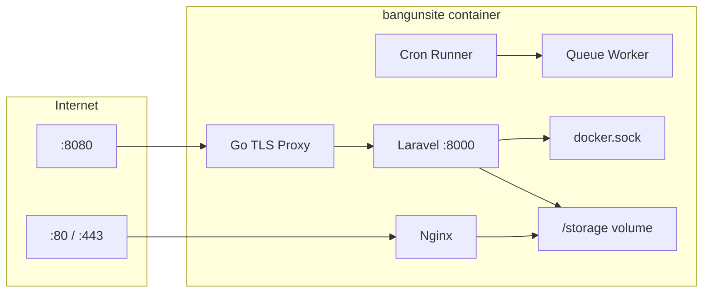

# Arsitektur BangunSite → GoSite

## Runtime saat ini

Satu container Docker `bangunsite` menjalankan empat proses via Supervisor:

| Proses | Port | Peran |
|--------|------|-------|
| `nginx` | 80, 443 | Reverse proxy, static files, vhost dari `active.d/` |
| `artisan server` | 8000 | Panel Laravel (PHP built-in server + custom ini) |
| `server-proxy` (Go) | 8080 | TLS termination panel → forward ke :8000 |
| `artisan run:cronjobs` | — | Scheduler cron + `queue:work` |



## Startup sequence (ringkas)

Lihat detail: [sequences/01-container-startup.md](./sequences/01-container-startup.md)

`config/start.sh` melakukan:

1. Buat struktur `/storage/logs`, `/storage/www`, `/storage/webconfig`, dll.
2. Copy template nginx/php/webconfig jika belum ada
3. Symlink `/storage` → `/etc/nginx`, `/etc/php`, `/app/storage`, `/www`
4. `composer install` + generate `.env` + `key:generate` jika first run
5. `migrate` + `db:seed` SQLite jika belum ada
6. Generate self-signed SSL default jika belum ada
7. `fstab_mounter.sh` — mount semua entry `/etc/fstab`
8. `supervisord` start semua program

## Layer aplikasi Laravel (legacy)

```
HTTP Request
  → Middleware (BasicAuth, auth, CSRF, CleanResponse)
  → Controller
  → Library / Facade (Site, Nginx, SSL, Disk, FPM, …)
  → Model (Eloquent) / filesystem / shell (Commander)
  → Response (Blade view | JSON)
```

## Usulan layer GoSite

```
HTTP Request (REST/JSON)
  → Middleware (auth JWT/session, rate limit, CORS)
  → Handler (thin)
  → Usecase / Service
  → Repository (SQLite) | Infrastructure (exec, fs, docker API)
  → JSON Response
```

Frontend (belum dipilih) hanya memanggil handler di atas.

## Batas modul backend Go

| Modul | Tanggung jawab | Dependency infrastruktur |
|-------|----------------|--------------------------|
| `auth` | Login, session/token, basic auth gate | SQLite `users` |
| `system` | CPU, RAM, disk, network, health | `/proc`, `df`, `free` |
| `website` | CRUD site, enable/disable | SQLite + `site.d/` + `active.d/` |
| `nginx` | Test config, reload, edit global/default | `nginx -t`, `supervisorctl` |
| `ssl` | Certbot, manual cert, status check | `certbot`, file SSL |
| `docker` | List/restart/stop/logs | `docker.sock` |
| `files` | File manager | filesystem `/www`, path validation |
| `mount` | fstab CRUD + mount/umount | `/etc/fstab`, `mount` |
| `cron` | CRUD + scheduler + manual run | SQLite + queue/job runner |
| `settings` | Profile + PHP/FPM config | file `/storage/php/*` |
| `logs` | Tail access/error log | `/storage/logs/` |
| `database` | SQLite viewer (admin tool) | `/storage/db.sqlite` |

## Path persisten penting

| Path | Isi |
|------|-----|
| `/storage/db.sqlite` | Database panel |
| `/storage/webconfig/site.d/` | Config nginx per domain (draft) |
| `/storage/webconfig/active.d/` | Symlink vhost aktif |
| `/storage/webconfig/site.conf` | Template vhost |
| `/storage/webconfig/ssl/` | Sertifikat (Let's Encrypt layout) |
| `/storage/logs/` | Nginx access/error + gosite process logs |
| `/storage/nginx/` | nginx.conf, http.d/, custom.d/ |
| `/storage/fstab` | Mount entries (symlink `/etc/fstab`) |
| `/www/` | Document root website |
| `/var/run/docker.sock` | Akses Docker dari dalam container |

## Yang tidak perlu di-port ke Go (opsional)

| Komponen | Catatan |
|----------|---------|
| Blade views | Diganti SPA |
| Laravel Mail | Bisa jadi notifikasi webhook/email service terpisah |
| Laravel Queue (DB driver) | Ganti job queue Go (channel + worker) |
| `php artisan server` | Panel Go tidak butuh PHP built-in server |
| Go TLS proxy terpisah | Bisa digabung: Go serve HTTPS :8080 langsung |

## Produksi (konteks)

Di VM BangunSoft, BangunSite adalah **edge nginx** — vhost di `active.d/` mem-proxy ke upstream (BangunInfo/go-waf, phpMyAdmin, Grafana). Migrasi GoSite harus tetap menghasilkan format nginx config yang kompatibel.
