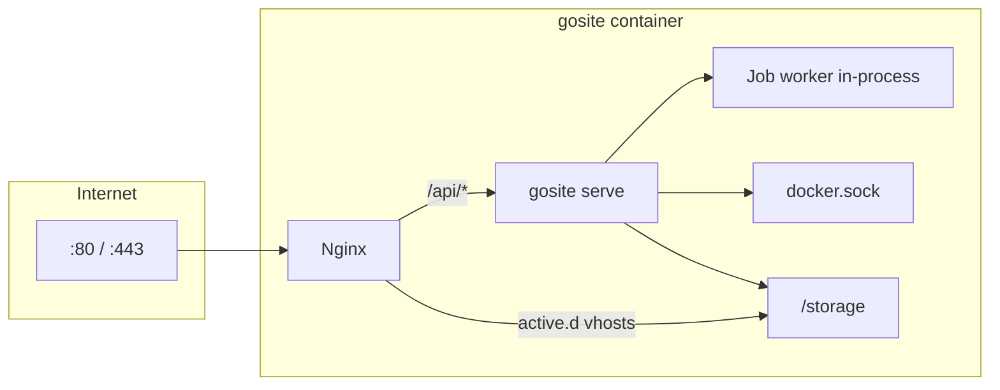

# GoSite Architecture

## Current runtime

A single Docker container runs **nginx** (edge) and **gosite serve** (API + SPA). Nginx is started from `start.sh`; reload/restart lifecycle is owned by Go.

| Process | Port | Role |
|---------|------|------|
| `nginx` | 80, 443 | Reverse proxy, vhosts from `active.d/`, default panel vhost |
| `gosite serve` | 8080 (loopback) | REST API `/api/v1`, SPA `/panel/`, job worker, nginx watchdog |

Nginx proxies `/api/` → `gosite:8080`. No PHP or separate TLS proxy.



## Startup sequence

Details: [sequences/01-container-startup.md](./sequences/01-container-startup.md)

`config/start.sh`:

1. `gosite init` — storage layout, symlinks, migrate, seed
2. Generate default self-signed SSL if missing
3. **`gosite nginx-repair`** — `nginx -t` + auto-fix ([nginx-repair.md](./nginx-repair.md))
4. Stage `/var/setup` → `/etc/nginx`, `/storage/webconfig`
5. `fstab_mounter.sh`
6. `nginx` → `exec gosite serve` (watchdog in Go)

## Go application layers

```
HTTP Request
  → Gin middleware (CORS, BasicAuth, session)
  → Handler (internal/delivery/http/handler)
  → Service (internal/service/*)
  → Repository (SQLite) | Infrastructure (nginx, job, docker, commander)
  → JSON / SSE
```

Preact frontend (`web/`) calls `/api/v1/*` only.

## Backend modules

| Module | Package | Responsibility |
|--------|---------|----------------|
| `auth` | `internal/service/auth` | Session, lockscreen, basic auth gate |
| `website` | `internal/service/website` | CRUD, enable/disable, validate |
| `nginx` | `internal/infra/nginx` | Test, reload, repair, vhost templates |
| `ssl` | `internal/service/ssl` | Certbot job, manual PEM, prepare certbot |
| `cron` | `internal/service/cron` + `infra/job` | Cron CRUD, manual run SSE |
| `docker` | `internal/service/docker` | Container ops |
| `files` | `internal/service/files` | File manager |
| `mount` | `internal/service/mount` | fstab |
| `logs` | `internal/service/logs` | Log viewer |
| `splunklite` | `internal/observability/splunklite` | Audit + log query |
| `grafanalite` | `internal/observability/grafanalite` | Traffic metrics |
| `database` | `internal/service/database` | SQLite viewer |
| `system` | `internal/service/system` | CPU, RAM, disk, network |
| `settings` | `internal/service/settings` | User profile |
| `uimeta` | `internal/service/uimeta` | UI hints & labels |
| `plugin` | `internal/service/plugin` | Registry, hooks, tier 0/1 runtime, remote install (`remote/`), catalog, health supervisor |
| `terminal` | `internal/terminal` | Floating xterm.js (topbar popup) — PTY session registry, rolling dump 256KB to `/tmp`, 12h sticky TTL, 1-writer-N-readers multi-attach |

## Nginx: draft vs active

| Path | Role |
|------|------|
| `/storage/webconfig/site.d/{domain}.conf` | Draft vhost (always present after create) |
| `/storage/webconfig/active.d/{domain}.conf` | Symlink to `site.d` when `active=true` |
| `/etc/nginx/nginx.conf` | Includes `active.d/*.conf` (not `site.d`) |

Production `nginx -t` loads **all** active vhosts + `http.d/default.conf`.

Website validate uses isolated `config/webconfig/nginx.conf` (single vhost file, no side effects on `site.d`).

## SSL & Let's Encrypt

| Symlink | Target |
|---------|--------|
| `/etc/letsencrypt` | `/storage/webconfig/ssl` |

Certbot and website placeholder SSL share the `live/{domain}/` namespace. See [sequences/08-website-ssl.md](./sequences/08-website-ssl.md).

## Persistent paths

| Path | Contents |
|------|----------|
| `/storage/db.sqlite` | Panel SQLite |
| `/storage/webconfig/site.d/` | Draft nginx per domain |
| `/storage/webconfig/active.d/` | Active vhost symlinks |
| `/storage/webconfig/ssl/` | Certificates (LE layout) |
| `/storage/logs/` | Nginx access/error + gosite |
| `/storage/nginx/` | Symlink source for `/etc/nginx` |
| `/www/` | Document roots (`/storage/www`) |

## Legacy (BangunSite)

BangunSite ran nginx + PHP artisan :8000 + Go proxy :8080 + PHP cron. Legacy diagrams remain in sequence docs under collapsible sections.

On BangunSoft production, edge nginx proxies to upstreams (BangunInfo, Grafana, etc.). GoSite vhost format (`site-proxy.conf`) stays compatible.
