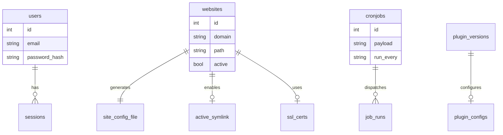
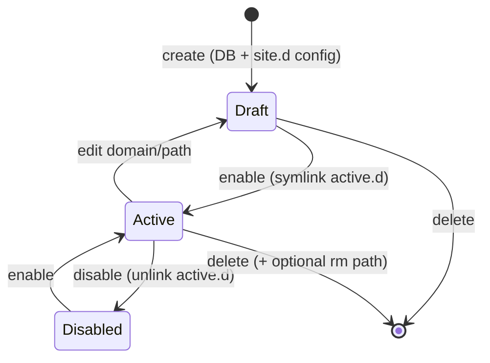

# Domain Model

Entities and filesystem artifacts the Go backend must understand. **v1.3.1** includes plugin registry + observability extensions.

## Database entities (SQLite)

### `users`

| Column | Type | Notes |
|--------|------|-------|
| id | int | PK |
| name | string | Display name |
| email | string | Login identifier |
| password | string | bcrypt hash |
| timestamps | | created_at, updated_at |

Default seed: `admin@demo.com` / `123456`

### `websites`

| Column | Type | Notes |
|--------|------|-------|
| id | int | PK |
| name | string | Display label |
| domain | string | nginx `server_name` |
| path | string | document root (`/www/...`) |
| type | string | `static` \| `proxy` (GoSite) |
| upstream | string | Proxy upstream when `type=proxy` |
| ssl | bool | SSL enabled flag (legacy) |
| config | text | Extra config (rarely used) |
| active | bool | Site enabled (`active.d` symlink) |
| timestamps | | |

### `cronjobs`

| Column | Type | Notes |
|--------|------|-------|
| id | int | PK |
| name | string | Label |
| payload | string | Shell command |
| run_every | string | `min` \| `hour` \| `day` \| `month` |
| executed_at | datetime | Last run |
| timestamps | | |

Default seed: Let's Encrypt renewal — `certbot renew --post-hook 'nginx -s reload'`

### `settings`

Key-value store (migrations exist; minimally used in legacy).

### `job_runs` (GoSite)

| Column | Type | Notes |
|--------|------|-------|
| id | int | PK |
| job_type | string | `certbot`, `cron`, … |
| name | string | Label (e.g. domain) |
| status | string | `pending`, `running`, `ok`, `failed`, `cancelled` |
| output | text | Command + stdout/stderr |
| error | text | Failure message |
| timestamps | | |

Certbot and manual cron runs share the same worker (`internal/infra/job/worker.go`). Output is streamed via SSE.

### `sessions` (GoSite)

| Column | Type | Notes |
|--------|------|-------|
| id | text | PK — session token id |
| user_id | int | FK → users |
| created_at | datetime | |
| expires_at | datetime | Sweeper removes expired rows |

### `audit_logs`, `log_events`, `traffic_metrics`, `saved_queries` (GoSite)

Observability tables from migration `002_gosite_extensions.sql`. Splunk Lite queries audit + log tail; Grafana Lite aggregates `traffic_metrics`.

### `nginx_status_samples`, `nginx_vts_*_samples` (GoSite)

Real-time nginx metrics from [seq 22](../sequences/22-nginx-metrics.md):

| Table | Source | Retention |
|-------|--------|-----------|
| `nginx_status_samples` | stub_status poll (30s) | `LOG_EVENTS_RETENTION_DAYS` |
| `nginx_vts_server_samples` | VTS `serverZones` | same |
| `nginx_vts_upstream_samples` | VTS `upstreamZones` peers | same |

Migrations: `009_nginx_status_samples.sql`, `010_nginx_vts_samples.sql`.

### `plugin_versions` (GoSite)

Registry row per `(plugin_id, version)`. State machine: `installing` → `installed` → `enabling` → `enabled` → … (see [sequences/19-plugin-installer.md](./sequences/19-plugin-installer.md)).

Key columns: `tier`, `manifest_json`, `capabilities_json`, `ui_json`, `artifact_digest`, `artifact_path`, `state`, failure fields.

**Provenance** (migration `007_plugin_provenance.sql`): `source_type`, `source_ref`, `resolved_url`, `resolved_digest`, `source_commit`, `source_repository`, `install_path`, `permissions_ack_at`, `permissions_acked_caps`, `install_log` (JSON steps).

### `plugin_configs` (GoSite)

Per-version config: `config_json` (plaintext fields), `secrets_encrypted` (AES-256-GCM blob), `config_version`.

### `plugin_access_tokens` (GoSite — planned P6-host-auth)

Integration tokens for MCP and future tier-0 webhooks. See [integration-tokens.md](../reference/integration-tokens.md).

| Column | Notes |
|--------|-------|
| `id` | UUID PK |
| `plugin_id` | Stable `vendor/name` FK — survives version switch |
| `created_under_version` | Semver at create (audit only) |
| `label`, `token_hash`, `scopes_json` | Operator label; SHA-256 hash; JSON scope array |
| `created_by_user_id` | FK → users |
| `created_at`, `expires_at`, `revoked_at`, `last_used_at` | Lifecycle; `last_used_at` updated every use |

### Plugin keyring (filesystem)

Trusted ed25519 vendor keys at `PLUGIN_KEYRING_PATH` (default `/storage/plugins/keyring.json`) — not a SQL table. Managed via `GET/POST/DELETE /plugins/keyring`.

### `jobs` / `failed_jobs` (legacy Laravel)

Not used by GoSite.

## Filesystem artifacts (not in DB)

### Per-domain nginx vhost

- **Draft:** `/storage/webconfig/site.d/{domain}.conf`
- **Active:** `/storage/webconfig/active.d/{domain}.conf` → symlink to `site.d/`
- **Template:** `/storage/webconfig/site.conf` with placeholders `<domain>`, `<path>`, `<ssl_cert>`, `<ssl_key>`

### Per-domain SSL

- Default: `/storage/webconfig/ssl/live/default/cert.pem` + `key.pem` (self-signed at boot)
- Website create placeholder: `/storage/webconfig/ssl/live/{domain}/cert.pem` + `key.pem`
- Let's Encrypt (after certbot): `live/{domain}/fullchain.pem`, `privkey.pem` (+ symlinks to `archive/`)
- **Symlink:** `/etc/letsencrypt` → `/storage/webconfig/ssl` (created by `gosite init`)

Certbot refuses to create a lineage when `live/{domain}/` already exists as a Gosite placeholder. The SSL service runs `prepareForCertbot` before enqueue (see [sequences/08-website-ssl.md](./sequences/08-website-ssl.md)).

### Per-domain nginx logs

- Access: `/storage/logs/access-{domain}.log`
- Error: `/storage/logs/error-{domain}.log`
- Global: `access.log`, `error.log`

### Plugin artifacts

- **Install tree:** `/storage/plugins/{plugin_id}/{version}/` — extracted zip + `manifest.json` snapshot path in DB (`artifact_path`)
- **Keyring:** `/storage/plugins/keyring.json` (override with `PLUGIN_KEYRING_PATH`)

## Conceptual relationships

## State: website lifecycle

## Business validation (must be preserved)

| Rule | Legacy check |
|------|--------------|
| Domain format | `FILTER_VALIDATE_DOMAIN` |
| Unique path | Must not be used by another website |
| Safe path | `Disk::validatePath()` — block traversal/illegal chars |
| Path not a file | `is_file($path)` rejected |
| Nginx config | `nginx -t` before reload; rollback on failure |
| Login | Rate limit 5× / 60 seconds per IP |
| File execute | Minimum permission 775 |
| Plugin install | Signature / allow-unsigned policy; remote fetch allowlist; `permissions_ack` for remote installs |
| PHP/FPM config | **Not ported** — BangunSite only |

## Relevant environment variables

| Var | Default | Effect |
|-----|---------|--------|
| `AUTH_ENABLE` | false | HTTP Basic Auth in front of login |
| `AUTH_USER` / `AUTH_PASS` | admin/admin | Basic auth credentials |
| `ENABLE_LOCKSCREEN` | false | Auto-lock session |
| `LOCK_AFTER` | 300 | Idle seconds before lock |
| `WEB_PATH` | /www | File manager root & default site |
| `MAIL_NOTIFICATION` | true | Email on sensitive actions |
| `DB_DATABASE` | /storage/db.sqlite | SQLite path |
| `PLUGIN_REMOTE_INSTALL` | true | Disable URL/GitHub/GitLab install when false |
| `PLUGIN_INSTALL_ALLOWED_HOSTS` | github.com,… | Fetch allowlist |
| `PLUGIN_ALLOW_UNSIGNED` | false in prod | Dev-only unsigned artifacts |
| `PLUGIN_KEYRING_PATH` | /storage/plugins/keyring.json | Trusted signing keys |
| `PLUGIN_CONFIG_KEY` | — | AES key for plugin secret fields (required for config UI) |
| `GITHUB_TOKEN` / `GITLAB_TOKEN` | — | Optional private repo / rate limits |
| `PLUGIN_BUILD_ENABLED` | true in dev | Docker build fallback (G2b) |
| `TERMINAL_STICKY_TTL` | 12h | PTY session sticky reattach window |
| `GOSITE_NGINX_STUB_STATUS_URL` | `http://127.0.0.1:18081/nginx_status` | stub_status collector; empty disables |
| `GOSITE_NGINX_VTS_URL` | `http://127.0.0.1:18082/status/format/json` in prod image | VTS collector; empty disables |
| `FE_EMBED` | false | Embed built SPA in Go binary |
