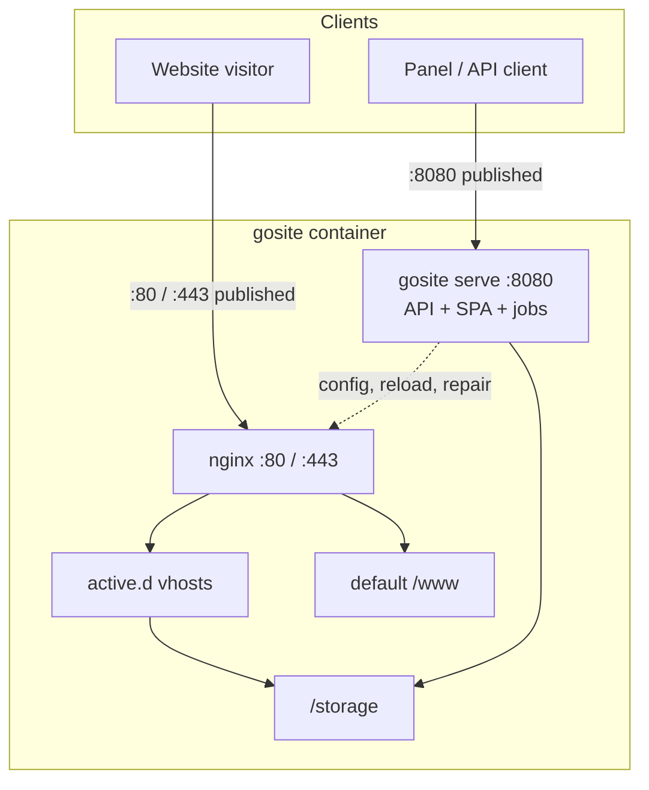

# GoSite Architecture

**Status:** Aligned with **v1.3.1** (plugin platform + remote install wave G). ADR: [plugin-platform.md](./plugin-platform.md).

## Current runtime

One Docker container runs **two independent listeners**. They do **not** proxy traffic to each other.

| Process | Published ports (compose) | Role |
|---------|---------------------------|------|
| `nginx` | `80`, `443` (+ UDP/QUIC) | **Website edge** — `active.d/` vhosts + default welcome under `/www` |
| `gosite serve` | `8080` (prod: `1100→8080`) | **Control panel** — REST `/api/v1`, embedded SPA, job worker, nginx watchdog |

**Traffic split** (`compose.yml`, `compose.prod.yml`, `compose.bangunsoft.yml`):

- Panel users → **`https://<host>:8080`** (or `:1100` on BangunSoft) → `gosite` directly.
- Website visitors → **`:80` / `:443`** → nginx only (static or `proxy_pass` upstream).
- `gosite` **manages** nginx (write `site.d` / `active.d`, `nginx -t`, `nginx -s reload`, [nginx-repair](../operations/nginx-repair.md)) but **hosted site traffic does not pass through gosite**.

No PHP. No legacy BangunSite `server-proxy` binary.



**Panel delivery:** SPA embedded in Go when `FE_EMBED=true`. Served at **`/` on `:8080`**, not via nginx. Dev: Vite `:5173` proxies `/api` → `https://localhost:8080`.

## Startup sequence

Details: [sequences/01-container-startup.md](../sequences/01-container-startup.md)

`config/start.sh`:

1. `gosite init` — storage layout, symlinks, migrate, seed
2. Generate default self-signed SSL if missing
3. **`gosite nginx-repair`** — `nginx -t` + auto-fix ([nginx-repair.md](../operations/nginx-repair.md))
4. Stage `/var/setup` → `/etc/nginx`, `/storage/webconfig`
5. `fstab_mounter.sh`
6. `nginx` → `exec gosite serve` (two parallel processes; gosite supervises nginx reload)

## Go application layers

```
HTTP Request
  → Gin middleware (CORS, BasicAuth, session)
  → Handler (internal/delivery/http/handler)
  → Service (internal/service/*)
  → Repository (SQLite) | Infrastructure (nginx, job, docker, commander)
  → JSON / SSE
```

Preact frontend (`web/`) calls `/api/v1/*` only. Navigation labels and feature flags come from `GET /ui/meta`.

### Hook bus (plugins)

Before irreversible side effects (nginx reload, SSL issue, job run, Docker action), services dispatch lifecycle hooks to **enabled** tier-0 webhooks and tier-1 go-plugin subprocesses. See [plugin-platform.md](./plugin-platform.md) and [sequences/19-plugin-installer.md](../sequences/19-plugin-installer.md).

## Backend modules

| Module | Package | Responsibility |
|--------|---------|----------------|
| `auth` | `internal/service/auth` | Session, lockscreen, basic auth gate |
| `website` | `internal/service/website` | CRUD, enable/disable, validate |
| `nginx` | `internal/infra/nginx` | Test, reload, repair, vhost templates |
| `ssl` | `internal/service/ssl` | Certbot job, manual PEM, prepare certbot |
| `cron` | `internal/service/cron` + `infra/job` | Cron CRUD, manual run SSE |
| `docker` | `internal/service/docker` | Container ops |
| `files` | `internal/service/files` | File manager |
| `mount` | `internal/service/mount` | fstab |
| `logs` | `internal/service/logs` | Log viewer |
| `splunklite` | `internal/observability/splunklite` | Audit + log query |
| `grafanalite` | `internal/observability/grafanalite` | Traffic metrics |
| `database` | `internal/service/database` | SQLite viewer |
| `system` | `internal/service/system` | CPU, RAM, disk, network |
| `settings` | `internal/service/settings` | User profile |
| `uimeta` | `internal/service/uimeta` | UI hints & labels |
| `plugin` | `internal/service/plugin` | Registry, hooks, tier 0/1 runtime, remote install (`remote/`), catalog, health supervisor |
| `terminal` | `internal/terminal` | Floating xterm.js (topbar popup) — PTY session registry, rolling dump 256KB to `/tmp`, 12h sticky TTL, 1-writer-N-readers multi-attach |

## CLI (`cmd/gosite`)

| Command | Role |
|---------|------|
| `gosite init` | Storage layout, symlinks, migrate, demo seed |
| `gosite migrate` | Apply SQL migrations only |
| `gosite serve` | HTTP API + optional embedded SPA + in-process job worker |
| `gosite nginx-repair` | `nginx -t` + safe auto-fix ([nginx-repair.md](../operations/nginx-repair.md)) |
| `gosite plugin list\|resolve\|install\|catalog` | Operator CLI over the same install APIs ([sequence 20](../sequences/20-plugin-remote-distribution-impl.md)) |

Boot order in production: `start.sh` → `init` → `nginx-repair` → `nginx` → `gosite serve`.

## Nginx: draft vs active

| Path | Role |
|------|------|
| `/storage/webconfig/site.d/{domain}.conf` | Draft vhost (always present after create) |
| `/storage/webconfig/active.d/{domain}.conf` | Symlink to `site.d` when `active=true` |
| `/etc/nginx/nginx.conf` | Includes `active.d/*.conf` (not `site.d`) |

Production `nginx -t` loads **all** active vhosts + `http.d/default.conf`.

Website validate uses isolated `config/webconfig/nginx.conf` (single vhost file, no side effects on `site.d`).

## SSL & Let's Encrypt

| Symlink | Target |
|---------|--------|
| `/etc/letsencrypt` | `/storage/webconfig/ssl` |

Certbot and website placeholder SSL share the `live/{domain}/` namespace. See [sequences/08-website-ssl.md](../sequences/08-website-ssl.md).

## Persistent paths

| Path | Contents |
|------|----------|
| `/storage/db.sqlite` | Panel SQLite |
| `/storage/webconfig/site.d/` | Draft nginx per domain |
| `/storage/webconfig/active.d/` | Active vhost symlinks |
| `/storage/webconfig/ssl/` | Certificates (LE layout) |
| `/storage/logs/` | Nginx access/error + gosite |
| `/storage/nginx/` | Symlink source for `/etc/nginx` |
| `/storage/plugins/` | Installed plugin artifacts `{plugin_id}/{version}/` |
| `/storage/plugins/keyring.json` | Trusted vendor signing keys (default; override `PLUGIN_KEYRING_PATH`) |
| `/www/` | Document roots (`/storage/www`) |

## Related docs

| Topic | Document |
|-------|----------|
| Plugin ADR | [plugin-platform.md](./plugin-platform.md) |
| Installer + lifecycle | [sequences/19-plugin-installer.md](../sequences/19-plugin-installer.md) |
| Remote distribution | [sequences/20-plugin-remote-distribution.md](../sequences/20-plugin-remote-distribution.md) |
| MCP integration (design) | [sequences/21-plugin-mcp.md](../sequences/21-plugin-mcp.md) |
| API surface | [api-inventory.md](../reference/api-inventory.md), [plugin-permissions.md](../reference/plugin-permissions.md), `api/openapi.yaml` |
| Doc maintenance | [DOCS-MAINTENANCE.md](../DOCS-MAINTENANCE.md) |

## Legacy (BangunSite)

BangunSite ran nginx + PHP artisan :8000 + Go proxy :8080 + PHP cron. Legacy diagrams remain in sequence docs under collapsible sections.

On BangunSoft production, edge nginx proxies to upstreams (BangunInfo, Grafana, etc.). GoSite vhost format (`site-proxy.conf`) stays compatible.
