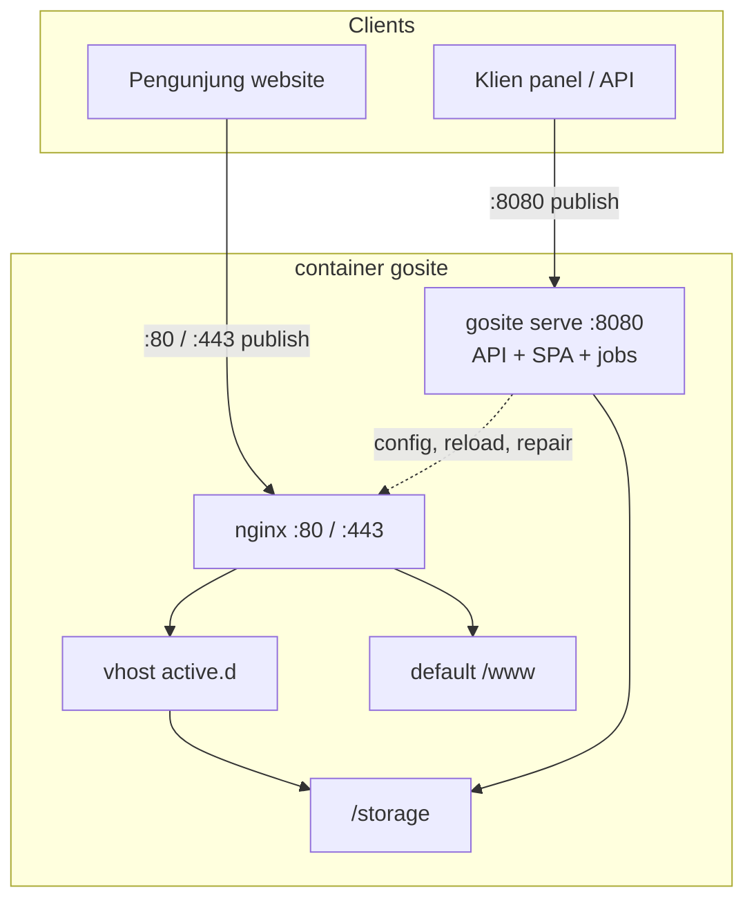

# Arsitektur GoSite

**Status:** Selaras **v1.3.1**. ADR plugin: [plugin-platform.md](./plugin-platform.md).

## Runtime saat ini

Satu container Docker menjalankan **dua listener independen**. Traffic panel **tidak** melalui nginx.

| Proses | Port publish (compose) | Peran |
|--------|------------------------|-------|
| `nginx` | `80`, `443` | **Edge website** — vhost `active.d/` + welcome `/www` |
| `gosite serve` | `8080` (prod: `1100→8080`) | **Panel kontrol** — REST `/api/v1`, SPA, job worker, watchdog nginx |

**Pemisahan traffic** (`compose.yml`, `compose.prod.yml`, `compose.bangunsoft.yml`):

- Pengguna panel → **`https://<host>:8080`** (atau `:1100` di BangunSoft) → langsung ke `gosite`.
- Pengunjung website → **`:80` / `:443`** → hanya nginx (static atau `proxy_pass`).
- `gosite` **mengontrol** nginx (tulis config, `nginx -t`, reload, [nginx-repair](../operations/nginx-repair_id.md)) — bukan reverse proxy untuk traffic website.

Tidak ada PHP. Tidak ada binary `server-proxy` legacy.



**Panel:** SPA di-embed di Go (`FE_EMBED=true`), dilayani di **`/` pada port `:8080`**, bukan lewat nginx.

## Startup sequence

Detail: [sequences/01-container-startup.md](../sequences/01-container-startup_id.md)

`config/start.sh`: `gosite init` → SSL default → `gosite nginx-repair` → stage nginx → `fstab_mounter` → **start nginx** → **exec gosite serve** (dua proses paralel).

## Layer aplikasi Go

```
HTTP Request (port :8080)
  → Gin middleware (CORS, BasicAuth, session)
  → Handler → Service → Repository / infra
  → JSON / SSE / WebSocket
```

Navigasi UI dari `GET /ui/meta`. Hook plugin sebelum side-effect nginx/SSL/job.

## Modul backend

| Modul | Paket | Tanggung jawab |
|-------|-------|----------------|
| `auth` | `internal/service/auth` | Session, lockscreen, basic auth |
| `website` | `internal/service/website` | CRUD, enable/disable, validate |
| `nginx` | `internal/infra/nginx` | Test, reload, repair (infra website) |
| `ssl` | `internal/service/ssl` | Certbot, manual PEM |
| `cron` | `internal/service/cron` + `infra/job` | Cron + SSE |
| `docker` | `internal/service/docker` | Container ops |
| `files` | `internal/service/files` | File manager |
| `mount` | `internal/service/mount` | fstab |
| `logs` | `internal/service/logs` | Log viewer |
| `splunklite` | `internal/observability/splunklite` | Audit + query |
| `grafanalite` | `internal/observability/grafanalite` | Traffic metrics (log buckets) |
| `nginxlite` | `internal/observability/nginxlite` | stub_status + VTS (poll localhost) |
| `database` | `internal/service/database` | SQLite viewer |
| `system` | `internal/service/system` | CPU, RAM, disk, network |
| `settings` | `internal/service/settings` | Profile (`PUT /settings/profile`) |
| `uimeta` | `internal/service/uimeta` | Labels navigasi |
| `plugin` | `internal/service/plugin` | Registry, hooks, remote install, catalog |
| `terminal` | `internal/terminal` | Terminal mengambang PTY |

## CLI

`gosite init` · `migrate` · `serve` · `nginx-repair` · `plugin list|resolve|install|catalog`

## Nginx: draft vs aktif

| Path | Peran |
|------|-------|
| `/storage/webconfig/site.d/{domain}.conf` | Draft vhost |
| `/storage/webconfig/active.d/{domain}.conf` | Symlink saat `active=true` |
| `/etc/nginx/nginx.conf` | Include `active.d/*.conf` |

## Path persisten

| Path | Isi |
|------|-----|
| `/storage/db.sqlite` | SQLite panel (VACUUM harian setelah retention purge) |
| `/storage/webconfig/` | nginx draft + SSL |
| `/storage/plugins/` | Artifact plugin |
| `/www/` | Document root website |

## Observability nginx (tanpa Prometheus)

Image production mengompilasi ulang nginx + VTS (`docker/nginx-vts/build.sh`). Endpoint internal:

- `127.0.0.1:18081/nginx_status` → stub_status
- `127.0.0.1:18082/status/format/json` → VTS

Detail: [22-nginx-metrics_id.md](../sequences/22-nginx-metrics_id.md).

## Legacy (BangunSite)

BangunSite: nginx + PHP :8000 + Go proxy :8080. GoSite: nginx hanya untuk website; panel di `:8080` terpisah.
