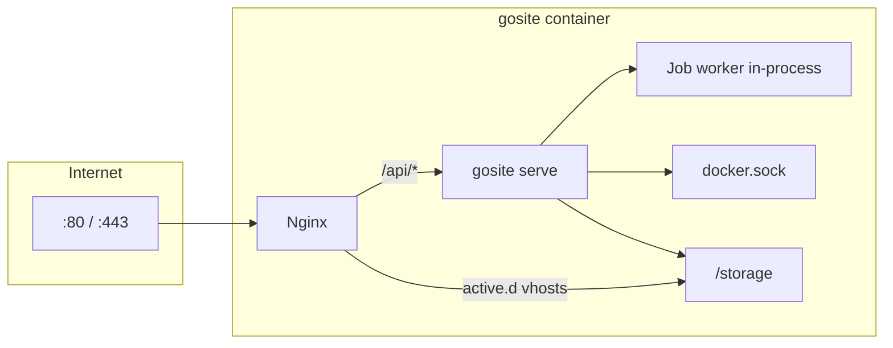

# Arsitektur GoSite

## Runtime saat ini

Satu container Docker menjalankan **nginx** (edge) dan **gosite serve** (API + SPA). Nginx di-start dari `start.sh`; lifecycle reload/restart dipegang Go.

| Proses | Port | Peran |
|--------|------|-------|
| `nginx` | 80, 443 | Reverse proxy, vhost dari `active.d/`, default vhost panel |
| `gosite serve` | 8080 (loopback) | REST API `/api/v1`, SPA `/panel/`, job worker, nginx watchdog |

Nginx mem-proxy `/api/` → `gosite:8080`. Tidak ada PHP atau TLS proxy terpisah.



## Startup sequence

Detail: [sequences/01-container-startup.md](./sequences/01-container-startup_id.md))

`config/start.sh`:

1. `gosite init` — layout storage, symlink, migrate, seed
2. Generate default self-signed SSL jika belum ada
3. **`gosite nginx-repair`** — `nginx -t` + auto-fix ([nginx-repair.md](./nginx-repair_id.md))
4. Staging `/var/setup` → `/etc/nginx`, `/storage/webconfig`
5. `fstab_mounter.sh`
6. `nginx` → `exec gosite serve` (watchdog di Go)

## Layer aplikasi Go

```
HTTP Request
  → Gin middleware (CORS, BasicAuth, session)
  → Handler (internal/delivery/http/handler)
  → Service (internal/service/*)
  → Repository (SQLite) | Infrastructure (nginx, job, docker, commander)
  → JSON / SSE
```

Frontend Preact (`web/`) hanya memanggil `/api/v1/*`.

## Modul backend

| Modul | Paket | Tanggung jawab |
|-------|-------|----------------|
| `auth` | `internal/service/auth` | Session, lockscreen, basic auth gate |
| `website` | `internal/service/website` | CRUD, enable/disable, validate |
| `nginx` | `internal/infra/nginx` | Test, reload, repair, template vhost |
| `ssl` | `internal/service/ssl` | Certbot job, manual PEM, prepare certbot |
| `cron` | `internal/service/cron` + `infra/job` | CRUD cron, manual run SSE |
| `docker` | `internal/service/docker` | Container ops |
| `files` | `internal/service/files` | File manager |
| `mount` | `internal/service/mount` | fstab |
| `logs` | `internal/service/logs` | Log viewer |
| `splunklite` | `internal/observability/splunklite` | Audit + log query |
| `grafanalite` | `internal/observability/grafanalite` | Traffic metrics |
| `database` | `internal/service/database` | SQLite viewer |
| `system` | `internal/service/system` | CPU, RAM, disk, network |
| `settings` | `internal/service/settings` | Profile user |
| `uimeta` | `internal/service/uimeta` | Hints & labels untuk UI |
| `plugin` | `internal/service/plugin` | Registry, hooks, runtime tier 0/1, install remote (`remote/`), catalog, supervisor |

## Nginx: draft vs aktif

| Path | Peran |
|------|-------|
| `/storage/webconfig/site.d/{domain}.conf` | Draft vhost (selalu ada setelah create) |
| `/storage/webconfig/active.d/{domain}.conf` | Symlink ke `site.d` jika `active=true` |
| `/etc/nginx/nginx.conf` | Include `active.d/*.conf` (bukan `site.d`) |

Production `nginx -t` memuat **semua** vhost aktif + `http.d/default.conf`.

Validate website memakai `config/webconfig/nginx.conf` terisolasi (satu file vhost, tanpa side-effect ke `site.d`).

## SSL & Let's Encrypt

| Symlink | Target |
|---------|--------|
| `/etc/letsencrypt` | `/storage/webconfig/ssl` |

Certbot dan placeholder website create berbagi namespace `live/{domain}/`. Lihat [sequences/08-website-ssl.md](./sequences/08-website-ssl_id.md)).

## Path persisten

| Path | Isi |
|------|-----|
| `/storage/db.sqlite` | SQLite panel |
| `/storage/webconfig/site.d/` | Draft nginx per domain |
| `/storage/webconfig/active.d/` | Symlink vhost aktif |
| `/storage/webconfig/ssl/` | Sertifikat (LE layout) |
| `/storage/logs/` | Access/error nginx + gosite |
| `/storage/nginx/` | Symlink source untuk `/etc/nginx` |
| `/www/` | Document root (`/storage/www`) |

## Legacy (BangunSite)

BangunSite menjalankan nginx + PHP artisan :8000 + Go proxy :8080 + PHP cron. Diagram dan modul Laravel dipertahankan di sequence docs sebagai referensi migrasi.

Di produksi BangunSoft, edge nginx mem-proxy ke upstream (BangunInfo, Grafana, dll.). Format vhost GoSite (`site-proxy.conf`) dirancang kompatibel.
