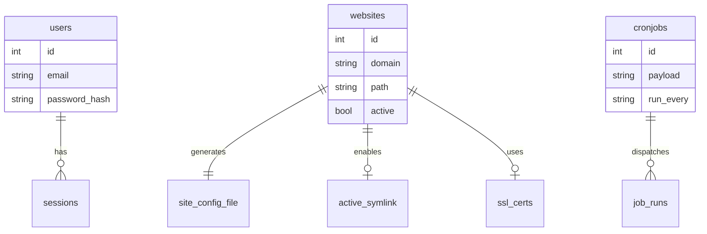
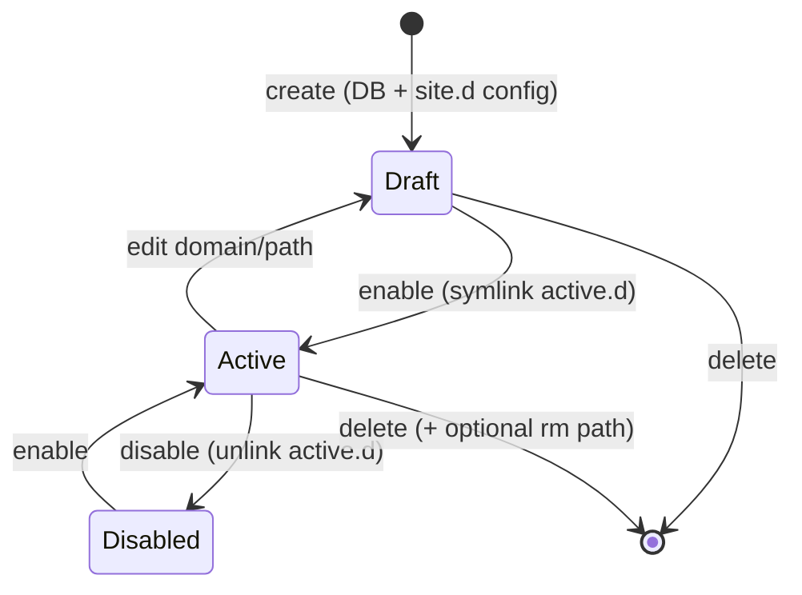

# Domain Model

Entitas dan artefak file yang harus dipahami backend Go.

## Entitas database (SQLite)

### `users`

| Kolom | Tipe | Keterangan |
|-------|------|------------|
| id | int | PK |
| name | string | Display name |
| email | string | Login identifier |
| password | string | bcrypt hash |
| timestamps | | created_at, updated_at |

Default seed: `admin@demo.com` / `123456`

### `websites`

| Kolom | Tipe | Keterangan |
|-------|------|------------|
| id | int | PK |
| name | string | Label tampilan |
| domain | string | server_name nginx |
| path | string | document root (`/www/...`) |
| ssl | bool | Flag SSL aktif (legacy) |
| config | text | Config tambahan (jarang dipakai) |
| active | bool | Site enabled (symlink di active.d) |
| timestamps | | |

### `cronjobs`

| Kolom | Tipe | Keterangan |
|-------|------|------------|
| id | int | PK |
| name | string | Label |
| payload | string | Shell command |
| run_every | string | `min` \| `hour` \| `day` \| `month` |
| executed_at | datetime | Terakhir dijalankan |
| timestamps | | |

Default seed: Let's Encrypt renewal — `certbot renew --post-hook 'supervisorctl restart nginx'`

### `settings`

Key-value store (migrations ada; dipakai minimal di legacy).

### `jobs` / `failed_jobs`

Laravel queue — di GoSite diganti mekanisme job internal.

## Artefak filesystem (bukan DB)

### Vhost nginx per domain

- **Draft:** `/storage/webconfig/site.d/{domain}.conf`
- **Aktif:** `/storage/webconfig/active.d/{domain}.conf` → symlink ke `site.d/`
- **Template:** `/storage/webconfig/site.conf` dengan placeholder `<domain>`, `<path>`, `<ssl_cert>`, `<ssl_key>`

### SSL per domain

- Default: `/storage/webconfig/ssl/live/default/cert.pem` + `key.pem`
- Per domain: `/storage/webconfig/ssl/live/{domain}/`
- Layout Let's Encrypt: `live/`, `archive/` (via certbot)

### Log nginx per domain

- Access: `/storage/logs/access-{domain}.log`
- Error: `/storage/logs/error-{domain}.log`
- Global: `access.log`, `error.log`

## Relasi konseptual

## State: website lifecycle

## Validasi bisnis (harus dipertahankan)

| Rule | Legacy check |
|------|--------------|
| Domain format | `FILTER_VALIDATE_DOMAIN` |
| Path unik | Tidak boleh dipakai website lain |
| Path aman | `Disk::validatePath()` — cegah traversal/illegal chars |
| Path bukan file | `is_file($path)` ditolak |
| Nginx config | `nginx -t` sebelum reload; rollback jika gagal |
| PHP/FPM config | `php -nc` / `php-fpm -t` sebelum simpan |
| Login | Rate limit 5x / 60 detik per IP |
| File execute | Permission minimal 775 |

## Environment variables relevan

| Var | Default | Pengaruh |
|-----|---------|----------|
| `AUTH_ENABLE` | false | HTTP Basic Auth di depan login |
| `AUTH_USER` / `AUTH_PASS` | admin/admin | Kredensial basic auth |
| `ENABLE_LOCKSCREEN` | false | Auto lock session |
| `LOCK_AFTER` | 300 | Detik idle sebelum lock |
| `WEB_PATH` | /www | Root file manager & default site |
| `MAIL_NOTIFICATION` | true | Email setiap aksi sensitif |
| `DB_DATABASE` | /storage/db.sqlite | Path SQLite |
