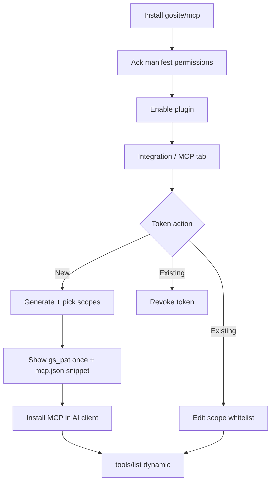

# MCP operator guide

How operators connect AI clients (Cursor, Claude Desktop, OpenClaw) to GoSite via the `gosite/mcp` plugin.

**Status:** Design — wave P6

**Prerequisites:** Install and enable `gosite/mcp`; generate a scoped `gs_pat_*` token in the Integration tab.

## Operator flow

```text
1. Install plugin gosite/mcp       → permissions_ack (manifest ceiling)
2. Enable plugin                   → Integration / MCP tab visible
3. Generate access token           → label, optional expiry
4. Select scope whitelist          → subset of manifest permissions
5. (Later) Edit scope whitelist    → PATCH scopes on existing token
6. Copy gs_pat_* once              → mcp.json / Cursor MCP settings
7. AI client spawns MCP stdio      → tools/list = scoped subset only
```



**Manifest `permissions`** = hard ceiling. Token `scopes[]` ⊆ manifest. Default scope picker pre-checks read-only scopes.

Install plugin in the AI client does **not** auto-register — operator copies config manually (wave 1).

## MCP client configuration

When `AUTH_ENABLE=true` (Basic Auth required):

```json
{
  "mcpServers": {
    "gosite": {
      "command": "npx",
      "args": ["-y", "@gosite/mcp"],
      "env": {
        "GOSITE_URL": "https://panel.example.com:8080",
        "GOSITE_BASIC_USER": "admin",
        "GOSITE_BASIC_PASS": "admin",
        "GOSITE_ACCESS_TOKEN": "gs_pat_..."
      }
    }
  }
}
```

When `AUTH_ENABLE=false` (token only — omit Basic vars):

```json
{
  "mcpServers": {
    "gosite": {
      "command": "npx",
      "args": ["-y", "@gosite/mcp"],
      "env": {
        "GOSITE_URL": "http://panel.example.com:8080",
        "GOSITE_ACCESS_TOKEN": "gs_pat_..."
      }
    }
  }
}
```

| Env | When | Maps to |
|-----|------|---------|
| `GOSITE_URL` | Always | Base URL, no trailing slash |
| `GOSITE_BASIC_USER` / `GOSITE_BASIC_PASS` | `AUTH_ENABLE=true` only | `AUTH_USER` / `AUTH_PASS` |
| `GOSITE_ACCESS_TOKEN` | Always (prod) | Token from plugin UI |

## Troubleshooting

| Symptom | Likely cause |
|---------|----------------|
| 401 on all tool calls | Token revoked, expired, or plugin disabled (suspended) |
| 403 on specific tool | Scope not on token; edit whitelist or restart MCP after scope add |
| Tool visible but 403 | Scope reduced — MCP will re-introspect on 403; restart if stuck |
| Double 403 | Should not happen — MCP retries only if tool still in registry after re-introspect |

## Related

- [plugin-integration-auth.md](../architecture/plugin-integration-auth.md) — auth layers
- [integration-tokens.md](../reference/integration-tokens.md) — token API & lifecycle
- [mcp-tools.md](../reference/mcp-tools.md) — tool catalog & manifest
- [21-plugin-mcp.md](../sequences/21-plugin-mcp.md) — sequence index
