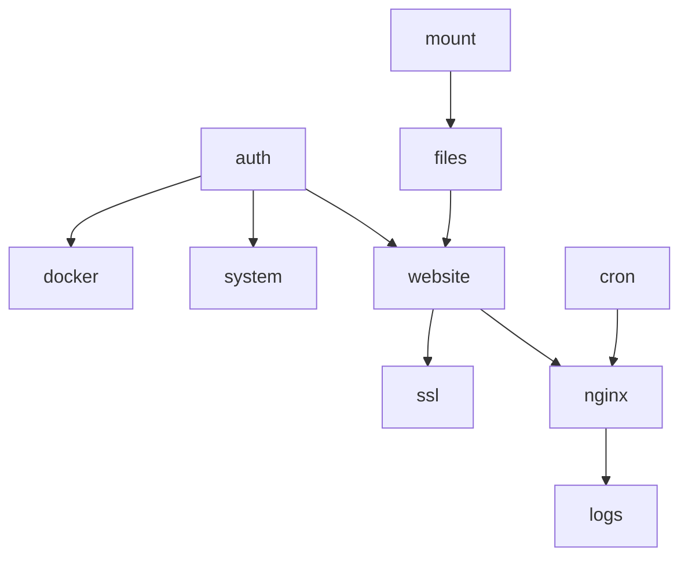

# Backend Modules — Rencana Implementasi Go

Pembagian paket dan urutan build untuk migrasi Laravel → Go.

## Struktur paket usulan

```text
gosite/
├── cmd/gosite/           # main binary (API + optional static FE)
├── internal/
│   ├── auth/
│   ├── system/           # CPU, RAM, disk, network
│   ├── website/
│   ├── nginx/
│   ├── ssl/
│   ├── docker/
│   ├── files/
│   ├── mount/
│   ├── cron/
│   ├── settings/
│   ├── logs/
│   └── database/         # SQLite viewer
├── pkg/
│   ├── commander/        # exec wrapper (ganti Commander.php)
│   └── pathutil/         # validate path
└── docs/                 # dokumen ini
```

## Lapisan per modul

```
handler/     → HTTP, binding, status code
usecase/     → business rules, validasi
repository/  → SQLite (users, websites, cronjobs)
infra/       → filesystem, nginx test, certbot, docker sock
```

## Fase implementasi

### Fase 0 — Fondasi

| Task | Output |
|------|--------|
| Binary startup + config env | Baca `/storage/.env` atau flags |
| SQLite connection | Compatible schema dengan legacy |
| Health endpoint | `GET /health` |
| Auth login/session | Ganti Laravel auth |

**Sequence acuan:** 01, 02, 03

### Fase 1 — Core panel

| Task | Output |
|------|--------|
| Dashboard APIs | system/info, network, nginx-traffic |
| Website CRUD | create, read, update, delete |
| Enable/disable | active.d symlink |
| Nginx config edit + test + reload | |

**Sequence acuan:** 04, 05, 06, 07, 09

### Fase 2 — SSL & ops

| Task | Output |
|------|--------|
| SSL manual upload | |
| Certbot job + stream | |
| Docker list/actions | |
| Log viewer | |

**Sequence acuan:** 08, 10, 15

### Fase 3 — Advanced ops

| Task | Output |
|------|--------|
| File manager | path allowlist ketat |
| Mount manager | fstab CRUD |
| Cron scheduler + worker | |
| Settings (PHP/FPM) | evaluasi: masih perlu jika panel tanpa PHP? |
| DB viewer | optional |

**Sequence acuan:** 11, 12, 13, 14, 16

## Keputusan teknis yang ditunda

| Topik | Opsi | Catatan |
|-------|------|---------|
| HTTP server | chi, echo, gin, std net/http | Pilih setelah API stabil |
| SQLite | modernc.org/sqlite, mattn/go-sqlite3 | CGO vs pure Go |
| Auth | JWT vs encrypted cookie | SPA-friendly |
| Job queue | channel + worker vs redis | Single container cukup in-memory |
| Docker | CLI vs official SDK | SDK lebih aman |
| PHP settings | keep vs drop | Jika Go tidak pakai PHP panel, modul FPM bisa deprecated |

## Kompatibilitas produksi

Saat cutover:

1. Stop container bangunsite
2. Mount `./data` yang sama
3. Start gosite — baca `db.sqlite`, `site.d/`, `active.d/` existing
4. Nginx config format **tidak berubah**
5. Rollback: start bangunsite lama jika perlu

## Testing per modul

Setiap sequence → minimal:

- [ ] Unit test usecase (validasi, state transition)
- [ ] Integration test dengan tmp dir (nginx -t mock)
- [ ] Contract test API JSON schema

## Dependency graph



Implementasi mengikuti topological order di atas.
