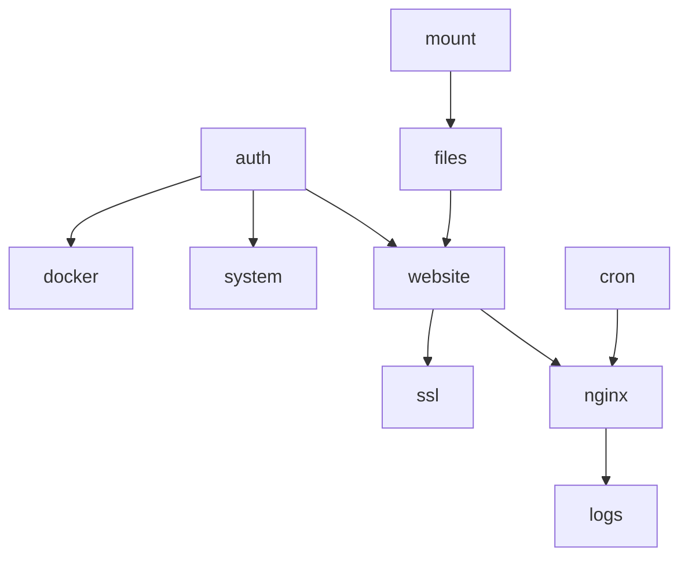

# Backend Modules — Implementasi GoSite

Pembagian paket dan status migrasi Laravel → Go.

## Struktur paket (aktual)

```text
gosite/
├── cmd/gosite/              # serve | init | migrate | nginx-repair
├── api/openapi.yaml         # Kontrak REST
├── internal/
│   ├── app/                 # RunServe, RunNginxRepair
│   ├── bootstrap/           # init, demo seed, symlinks
│   ├── config/
│   ├── delivery/http/       # handler, router, middleware, frontend embed
│   ├── infra/
│   │   ├── nginx/           # runner, service, repair, templates
│   │   ├── job/             # worker, SSE stream
│   │   ├── commander/
│   │   └── docker/
│   ├── observability/       # splunklite, grafanalite
│   ├── repository/sqlite/
│   └── service/             # auth, website, ssl, cron, files, …
├── web/                     # Preact SPA
├── config/                  # nginx, webconfig, start.sh
└── docs/
```

## Lapisan

```
handler/     → HTTP, binding, status code
service/     → business rules, validasi, orchestration
repository/  → SQLite
infra/       → nginx, job worker, exec, filesystem
```

## Status fase

### Fase 0 — Fondasi ✅

| Task | Paket |
|------|-------|
| `gosite init`, storage symlinks | `internal/bootstrap` |
| SQLite migrate | `internal/repository/sqlite` |
| Health | `handler/health` |
| Auth session + basic auth | `internal/service/auth` |

### Fase 1 — Website & nginx ✅

| Task | Paket |
|------|-------|
| Website CRUD + validate (no disk on validate) | `internal/service/website` |
| Enable/disable + reload | `website` + `infra/nginx` |
| Nginx edit global/default/site | `handler/nginx`, `handler/website` |
| **Nginx auto-repair** | `infra/nginx/repair.go` |

### Fase 2 — SSL & ops ✅ (core)

| Task | Paket |
|------|-------|
| SSL manual | `internal/service/ssl` |
| Certbot job + SSE + prepareForCertbot | `ssl` + `infra/job` |
| Docker, logs | `service/docker`, `service/logs` |

### Fase 3 — Advanced ✅

| Task | Paket |
|------|-------|
| File manager | `service/files` |
| Mount manager | `service/mount` |
| Cron scheduler + worker SSE | `service/cron`, `infra/job` |
| Splunk Lite, Grafana Lite | `observability/*` |
| DB viewer | `service/database` |

### Tidak di-port / deprecated

| Komponen | Catatan |
|----------|---------|
| PHP settings / FPM | Tidak relevan tanpa PHP panel |
| Laravel Queue | Diganti `job_runs` + worker |
| Go TLS proxy :8080 | API + SPA di `gosite serve`; nginx edge |

## Kompatibilitas produksi

Saat cutover:

1. Stop container bangunsite
2. Mount `./data` yang sama
3. Start gosite — baca `db.sqlite`, `site.d/`, `active.d/` existing
4. Nginx config format **tidak berubah**
5. Rollback: start bangunsite lama jika perlu

## Testing per modul

Setiap sequence → minimal:

- [ ] Unit test usecase (validasi, state transition)
- [ ] Integration test dengan tmp dir (nginx -t mock)
- [ ] Contract test API JSON schema

## Dependency graph



Implementasi mengikuti topological order di atas.
