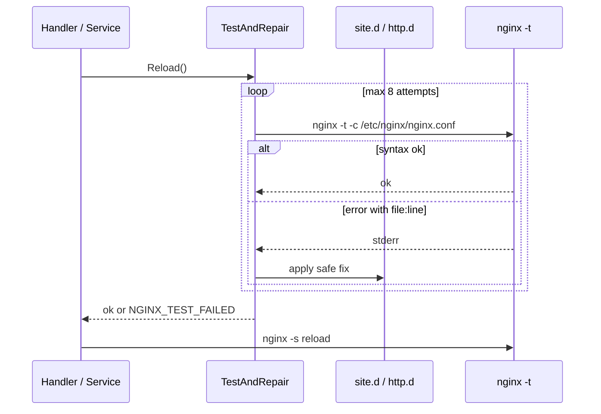

# Nginx Auto-Repair (Fallback)

GoSite runs `nginx -t` **before every reload** and, on failure, applies safe automatic fixes based on error messages (file + line). This prevents the panel or boot from leaving nginx with a broken config.

## When it runs

| Trigger | Code location |
|---------|---------------|
| `POST /api/v1/nginx/reload` | `internal/infra/nginx/service.go` → `Reload()` |
| Website toggle, nginx config update, manual SSL, etc. | All callers of `nginx.Service.Reload()` |
| Container boot | `config/start.sh` → `gosite nginx-repair` |
| Manual | `gosite nginx-repair` |

Reload flow:



## Files that may be repaired

Only paths under GoSite-managed prefixes:

- `/storage/webconfig/site.d/`
- `/storage/webconfig/active.d/` (symlinks resolve to `site.d`)
- `/storage/webconfig/` (templates, ssl)
- `/storage/nginx/`
- `/etc/nginx/` (global, `http.d/`, `custom.d/`)

Files outside allowed prefixes are **not** changed — repair stops and returns the error to the caller.

## Repair strategies

| nginx error pattern | Fix | Example |
|---------------------|-----|---------|
| `cannot load certificate` / `BIO_new_file() failed` | Replace `ssl_certificate` + `ssl_certificate_key` in server block with default self-signed | Cert missing after removing LE placeholder |
| `no "ssl_certificate" is defined for the "listen ... ssl"` | Insert default SSL directives after `listen` line | HTTPS server block without cert |
| `unknown directive` | Comment line (`# gosite-repair: ...`) | Module directive not loaded |
| `unknown "var" variable` | Comment line | Undefined variable |
| `invalid number of arguments` | Comment line | Directive typo |
| `directive is not allowed here` | Comment line | Wrong context |
| `duplicate listen options` | Comment duplicate `listen` line | Conflicting listen 443 |

Default certificate:

```
/storage/webconfig/ssl/live/default/cert.pem
/storage/webconfig/ssl/live/default/key.pem
```

Created at boot by `start.sh` (openssl self-signed) if missing.

## Intentional limits

- Does **not** fix unbalanced braces, upstream down, or DNS errors
- Does **not** delete lines — only comments them to preserve history
- SSL fallback = **default self-signed**, not Let's Encrypt
- Maximum **8** repair iterations per call

## Logging

CLI `gosite nginx-repair` prints each action:

```text
gosite nginx-repair: /storage/webconfig/site.d/example.com.conf:24 missing ssl certificate file -> use default self-signed certificate
gosite nginx-repair: applied 1 fix(es), configuration ok
```

## Relationship with website validate

`POST /websites/validate` **does not** write to `site.d`. Vhost test uses temporary files:

1. Render template to `/tmp/nginx-site-test-{domain}-{nano}.conf`
2. Clone `webconfig/nginx.conf`, replace `site.d/*.conf` include with **absolute** temp path
3. `nginx -t -c /tmp/nginx-test-{nano}.conf`
4. Delete temp files

See [sequences/07-website-nginx-config.md](./sequences/07-website-nginx-config.md).

## Code

| File | Role |
|------|-------|
| `internal/infra/nginx/repair.go` | Parse errors, fix strategies |
| `internal/infra/nginx/service.go` | `TestAndRepair()`, `Reload()` |
| `internal/app/nginx_repair.go` | CLI wiring |
| `config/start.sh` | Boot hook |
