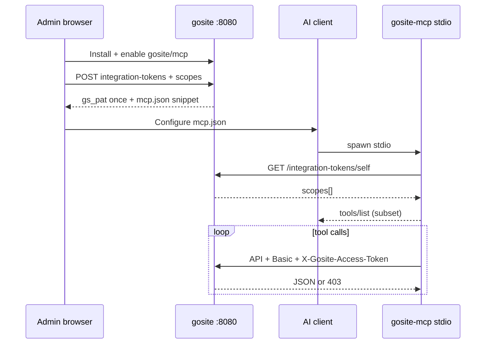

# MCP tools & `gosite/mcp` plugin

MCP tool registry, scope mapping, and official catalog plugin manifest.

**Status:** Design — P6b (tools); introspection API in P6-host-auth

**Operator setup:** [mcp-operator.md](../guides/mcp-operator.md) · **Tokens:** [integration-tokens.md](./integration-tokens.md) · **Scopes:** [plugin-permissions.md](./plugin-permissions.md)

## Architecture



### Runtime split (P6b)

| Binary | Role |
|--------|------|
| `plugin/gosite` | Optional go-plugin hooks (Tier 1 lifecycle) |
| `plugin/mcp` | MCP stdio entrypoint (`modelcontextprotocol/go-sdk`; P6a pins pre-GA spec, P6b adopts post-GA) |

**Host access (preferred):** narrow `pluginhostapi` RPC — capability context injected, no HTTP secrets in subprocess.

**Fallback:** loopback HTTP with token from encrypted config or env.

## Scope ↔ tool mapping

| Scope | MCP tool | OpenAPI area (indicative) |
|-------|----------|---------------------------|
| `system:read` | `system` | health, version |
| `websites:read` | `websites` (read) | list/get sites |
| `websites:write` | `websites` (mutate) | create/update/delete |
| `nginx:read` | `nginx` | test config |
| `nginx:manage` | `nginx` | reload |
| `docker:read` | `docker` | list, logs |
| `docker:manage` | `docker` | restart, stop |
| `jobs:read` | `jobs` | list, status |
| `plugins:read` | `plugins` | list installed meta |

**Dynamic `tools/list`:** MCP server registers only tools whose required scope(s) are on the token. The agent must not see tools outside the whitelist.

On startup, MCP binary calls `GET /api/v1/integration-tokens/self` with `X-Gosite-Access-Token`, then builds the tool registry. Host remains source of truth on every API call (403 if scope missing after edit).

### Re-introspect policy (locked)

| Trigger | MCP behavior |
|---------|--------------|
| Startup | Introspect once; build tool registry |
| `tools/list` request | On-demand refresh (no periodic poll) |
| 403 or 401 from host | Re-introspect + rebuild registry; **retry tool call once only if** the tool is still present in the rebuilt registry — otherwise return scope error immediately (no double 403) |
| Scope **added** via PATCH | Requires MCP process restart to see new tools (acceptable) |
| Token **expires** mid-session | Lazy invalidation on first 401 — not a bug; no periodic poll |

## MVP tool catalog

Consolidated tools (Coolify-style), one tool per domain with `action` parameter where needed:

| Tool | Default scope | Mutations |
|------|---------------|-----------|
| `system` | `system:read` | None |
| `websites` | `websites:read` | Requires `websites:write` |
| `nginx` | `nginx:read` / `nginx:manage` | Test vs reload |
| `docker` | `docker:manage` | Restart requires same scope |
| `jobs` | `jobs:read` | None in MVP |
| `plugins` | `plugins:read` | None in MVP |

Mutating tool invocations must fail closed at MCP layer (pre-check scope) and API layer (middleware).

## Official plugin manifest (`gosite/mcp`)

Location: monorepo `plugins/gosite/mcp/` (P6b). Community stdio `@gosite/mcp` in separate repo (P6a).

```json
{
  "id": "gosite/mcp",
  "name": "GoSite MCP",
  "version": "0.1.0",
  "tier": 1,
  "apiVersion": "gosite-plugin/1",
  "minGoSiteVersion": "1.4.0",
  "rpcVersion": "1",
  "capabilities": {
    "mcpServer": true,
    "uiSidebar": true,
    "configSchema": false
  },
  "permissions": [
    "system:read",
    "websites:read",
    "websites:write",
    "nginx:read",
    "nginx:manage",
    "docker:read",
    "docker:manage",
    "jobs:read",
    "plugins:read"
  ],
  "entrypoints": {
    "validate": { "type": "go-plugin", "command": "plugin/validate" },
    "runtime":  { "type": "go-plugin", "command": "plugin/gosite" },
    "mcp":      { "type": "stdio", "command": "plugin/mcp" }
  },
  "ui": {
    "sidebar": [
      { "label": "MCP Integration", "route": "/plugins/gosite/mcp/integration" }
    ]
  }
}
```

`entrypoints.mcp` is consumed by docs and optional host launcher; AI clients spawn `plugin/mcp` directly via `mcp.json`.

## P6c — HTTP remote (blocked)

Prerequisites: P6-host-auth + **dedicated listener** + TLS + MCP Origin validation + `PLUGIN_MCP_ALLOWED_HOSTS`.

> **Architecture dependency:** a third listener (separate from `gosite :8080` and nginx `:80/:443`) is a non-trivial change with **no scheduled sequence yet**. P6c is blocked until that architecture sequence exists.

Same `gs_pat_*` model — not cookie session.

## External references

- MCP spec transports: https://modelcontextprotocol.io/specification/2025-11-25/basic/transports
- Go SDK: https://github.com/modelcontextprotocol/go-sdk
