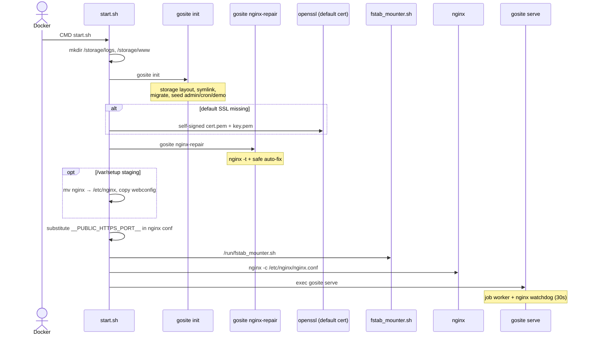
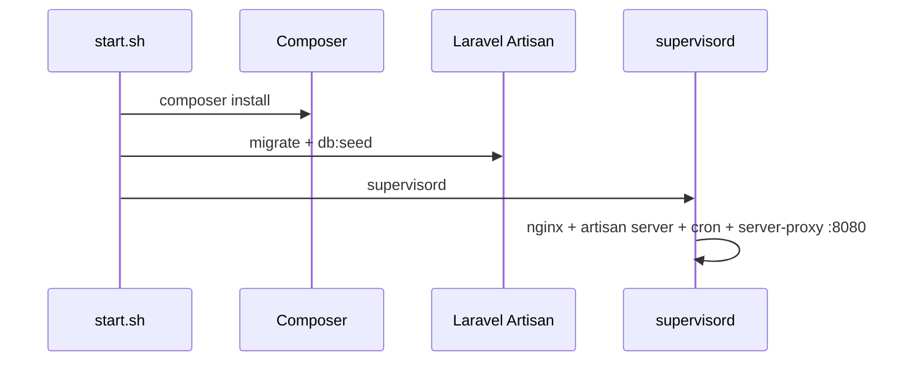

# Sequence: Container Startup

What happens when the GoSite container starts (first boot or restart).

**Entrypoint:** `config/start.sh` → nginx + `gosite serve`

## GoSite (current implementation)

### Runtime processes

| Process | Command | Notes |
|--------|---------|---------|
| nginx | `nginx -c /etc/nginx/nginx.conf` | Started from `start.sh`; reload/restart via Go |
| gosite | `gosite serve` | PID 1; watchdog restarts nginx if it dies |

Cron renewal and manual runs are handled by the **job worker** inside `gosite serve`, not a separate PHP process.

### `gosite init` (bootstrap)

| Step | Output |
|---------|--------|
| `createStorageLayout` | `/storage/webconfig`, `site.d`, `active.d`, `logs`, … |
| `copyTemplatesIfMissing` | Templates from image → storage |
| `createSymlinks` | `/etc/nginx` → `/storage/nginx`, `/etc/letsencrypt` → `/storage/webconfig/ssl`, `/www` → `/storage/www` |
| `sqlite.Migrate` | Schema `db.sqlite` |
| `seedAdminIfEmpty` | User demo |
| `seedDefaultCronIfEmpty` | `certbot renew --post-hook 'nginx -s reload'` |
| `seedDemoIfNeeded` | Demo website (when `DEMO_SEED=true`) |

### Boot nginx repair

`gosite nginx-repair` runs **after** the default SSL cert is created so fallback repair can point vhosts to the default cert. See [nginx-repair.md](../operations/nginx-repair.md).

---

## Legacy BangunSite (migration reference)

Historical Laravel startup diagram

| Program | Command |
|---------|---------|
| bangunsite | `php artisan server --port=8000` |
| proxy-server | Go TLS proxy :8080 |
| crond | `php artisan run:cronjobs` |

## Production invariants

- `/storage` layout compatible with legacy BangunSite deploy
- Symlink `/etc/letsencrypt` → `/storage/webconfig/ssl` — same path used by Certbot and Gosite placeholders
