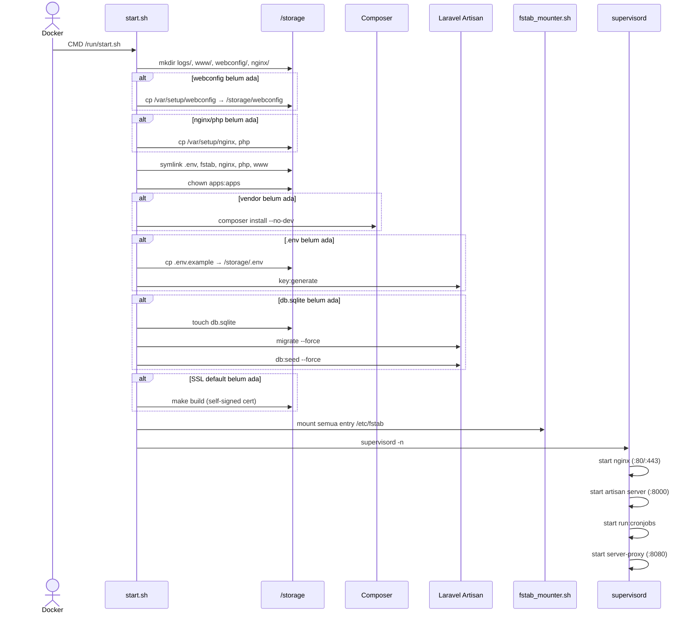

# Sequence: Container Startup

Proses saat container `bangunsite` pertama kali (atau restart) dijalankan.

**Entrypoint:** `config/start.sh` → `supervisord`

## Supervisor programs

| Program | Command | Prioritas |
|---------|---------|-----------|
| nginx | `nginx -g "daemon off;"` | 10 |
| bangunsite | `php artisan server --host=0.0.0.0 --port=8000` | 15 |
| crond | `php artisan run:cronjobs` | 16 |
| proxy-server | `/usr/bin/server-proxy` | 20 |

## Implikasi GoSite

- Startup script bisa tetap bash atau diganti binary `gosite init`
- Proses `artisan server` + `server-proxy` diganti satu binary Go (HTTP + HTTPS)
- Nginx & cron runner tetap proses terpisah atau dikelola Go supervisor
- Invariant: struktur `/storage` harus kompatibel agar data produksi bisa dipakai
