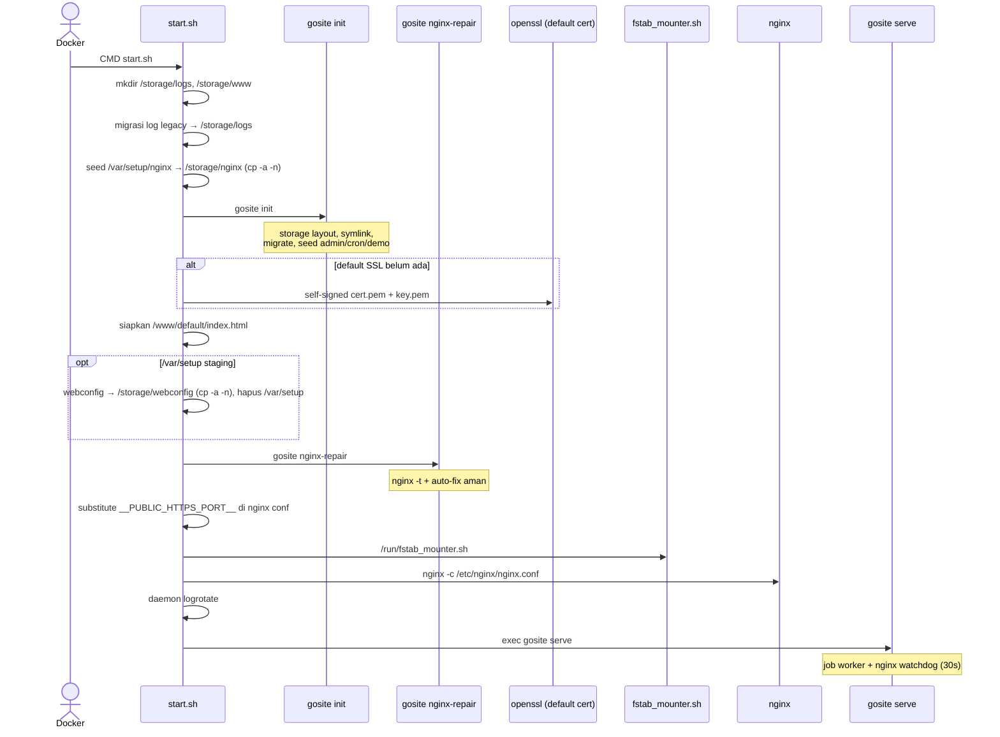
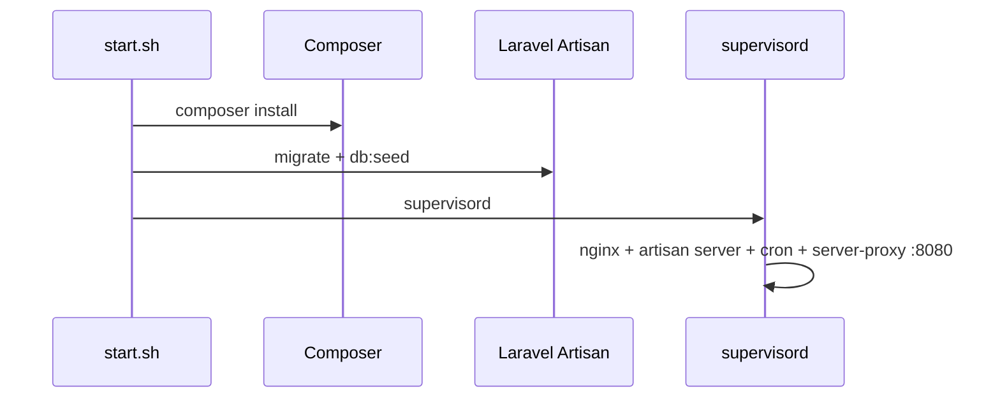

# Sequence: Container Startup

Proses saat container GoSite pertama kali (atau restart) dijalankan.

**Entrypoint:** `config/start.sh` → nginx + `gosite serve`

## GoSite (implementasi saat ini)

### Proses runtime

| Proses | Command | Catatan |
|--------|---------|---------|
| nginx | `nginx -c /etc/nginx/nginx.conf` | Di-start dari `start.sh`; reload/restart via Go |
| gosite | `gosite serve` | PID 1; watchdog start ulang nginx jika mati |

Cron job renewal & manual run dikelola **job worker** di dalam proses `gosite serve`, bukan proses PHP terpisah.

### `gosite init` (bootstrap)

| Langkah | Output |
|---------|--------|
| `createStorageLayout` | `/storage/webconfig`, `site.d`, `active.d`, `logs`, `nginx`, … (+ migrasi log legacy Laravel) |
| `copyTemplatesIfMissing` | Merge `/var/setup/{webconfig,nginx}` → `/storage`: file yang belum ada disalin (healing), file persisten tidak pernah ditimpa |
| `createSymlinks` | `/etc/nginx` → `/storage/nginx`, `/etc/letsencrypt` → `/storage/webconfig/ssl`, `/www` → `/storage/www` |
| `sqlite.Migrate` | Schema `db.sqlite` |
| `seedAdminIfEmpty` | User demo |
| `seedDefaultCronIfEmpty` | `certbot renew --post-hook 'nginx -s reload'` |
| `seedDemoIfNeeded` | Website demo (jika `DEMO_SEED=true`) |

Jika `/etc/nginx` masih berupa direktori nyata (bukan symlink), `createSymlinks` memigrasikan isinya ke `/storage/nginx` tanpa menimpa file yang sudah ada; entry konflik disimpan di `/storage/nginx.migrated-conflicts/`. Entry top-level `conf.d` bawaan image dikarantina ke `/storage/nginx.migrated-conflicts/conf.d/` supaya `listen 80 default_server` bawaannya tidak bentrok dengan vhost persisten.

### Kepemilikan config nginx

`/storage/nginx` adalah sumber kebenaran persisten untuk `/etc/nginx` — di-seed dari `/var/setup/nginx` dengan `cp -a -n` oleh `start.sh` sebelum `gosite init`. File template dari image hanya ditambahkan jika belum ada, jadi **update template di image tidak menimpa editan persisten** — rekonsiliasi manual diperlukan saat upgrade.

### Boot nginx repair

`gosite nginx-repair` dijalankan setelah staging `/var/setup` dibersihkan dan **sebelum** nginx start — juga setelah default SSL dibuat agar fallback repair bisa mengarahkan vhost ke cert default. Lihat [nginx-repair.md](../operations/nginx-repair_id.md).

---

## Legacy BangunSite (referensi migrasi)

Diagram startup Laravel (historis)

| Program | Command |
|---------|---------|
| bangunsite | `php artisan server --port=8000` |
| proxy-server | Go TLS proxy :8080 |
| crond | `php artisan run:cronjobs` |

## Invariant produksi

- Struktur `/storage` kompatibel dengan deploy BangunSite lama
- Symlink `/etc/letsencrypt` → `/storage/webconfig/ssl` — path yang sama dipakai Certbot dan placeholder Gosite
