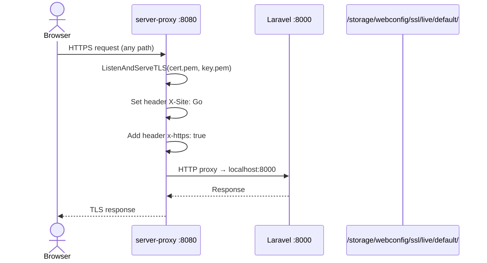

# Sequence: TLS Proxy Panel

Go reverse proxy yang melayani panel admin di port **8080** dengan TLS.

**Sumber:** `proxy/main.go`

## Detail teknis

| Item | Nilai |
|------|-------|
| Listen | `:8080` |
| Upstream | `http://localhost:8000` |
| TLS min version | TLS 1.2 |
| Read timeout | 60s |
| Cert path | `/storage/webconfig/ssl/live/default/` (fallback `../config/webconfig/...`) |

## Implikasi GoSite

- Tidak perlu proxy terpisah: backend Go bisa langsung `ListenAndServeTLS` di :8080
- Header `x-https: true` mungkin dipakai middleware legacy — evaluasi apakah masih diperlukan
- Nginx publik (:80/:443) tetap terpisah dari panel admin
