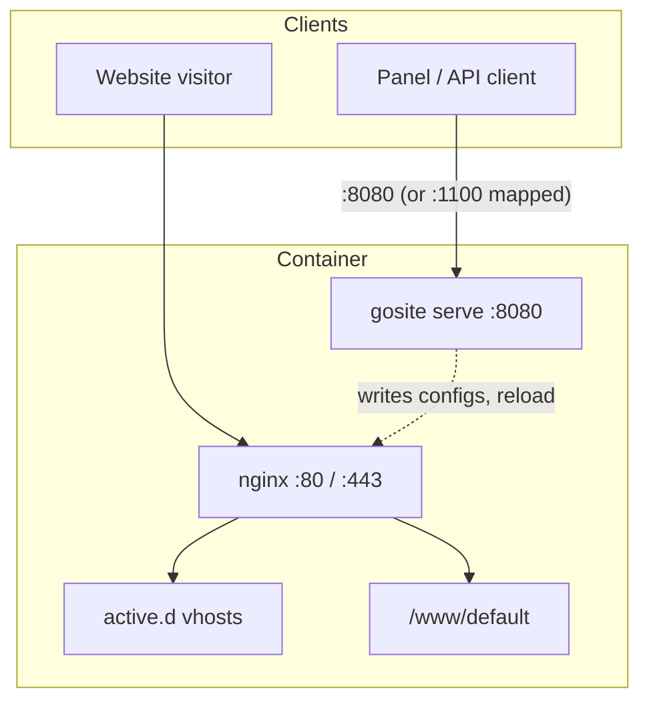

# Sequence: Panel port & TLS (parallel to nginx)

GoSite **does not** route panel traffic through nginx. The panel listens on **`LISTEN_ADDR` (default `:8080`)** with optional TLS (`TLS_ENABLE`). Nginx listens on **`:80` / `:443`** for **hosted websites only**.

Reference: `compose.bangunsoft.yml` comments — `:8080 → panel (independent of nginx)`, `:80/:443 → websites`.

## GoSite (implementation)

| Public entry | Handler | Notes |
|--------------|---------|-------|
| `https://<host>:8080/` | gosite | SPA + `/api/v1/*` on same port |
| `https://<host>:8080/health` | gosite | Liveness |
| `http(s)://<host>/` on **:80/:443** | nginx default vhost | Welcome `/www/default` |
| `http(s)://<customer-domain>/` | nginx `active.d` | Static or reverse-proxy site |

`gosite` does **not** sit in the website request path. It orchestrates nginx (create vhost files, enable/disable symlinks, certbot jobs, `POST /nginx/reload`).

### Middleware (panel port only)

- **HTTP Basic Auth** (`AUTH_ENABLE`) on `/api/v1/*`
- **Session cookie** after `POST /auth/login`
- TLS on `:8080` when `TLS_ENABLE=true` (self-signed or mounted certs)

### Relevant configuration

| Env | Default | Role |
|-----|---------|------|
| `LISTEN_ADDR` | `:8080` | Panel bind address |
| `TLS_ENABLE` | `true` | HTTPS on panel port |
| `FE_EMBED` | `false` | Serve built SPA from Go binary |
| `AUTH_ENABLE` | `true` | Basic auth on API |

### Docker port mapping

| File | Panel | Websites |
|------|-------|----------|
| `compose.yml` | `8080:8080` | `80:80`, `443:443` |
| `compose.prod.yml` | `1100:8080` | `80`, `443` (host mode) |
| `compose.bangunsoft.yml` | `1100:8080` only | nginx still runs inside container for managed sites |

Dev: `make dev-api` → `https://localhost:8080`; `make dev-fe` → Vite `:5173` proxies `/api` to Go.

---

## Legacy BangunSite

Go TLS proxy :8080 → Laravel :8000

Binary `proxy/main.go` accepted HTTPS on `:8080`, forwarding to `http://localhost:8000` (PHP artisan). Nginx served websites on 80/443 separately.

GoSite drops the proxy binary; panel stays on `:8080`, nginx stays on 80/443 — same **parallel** port model, different upstream (Go instead of PHP).

