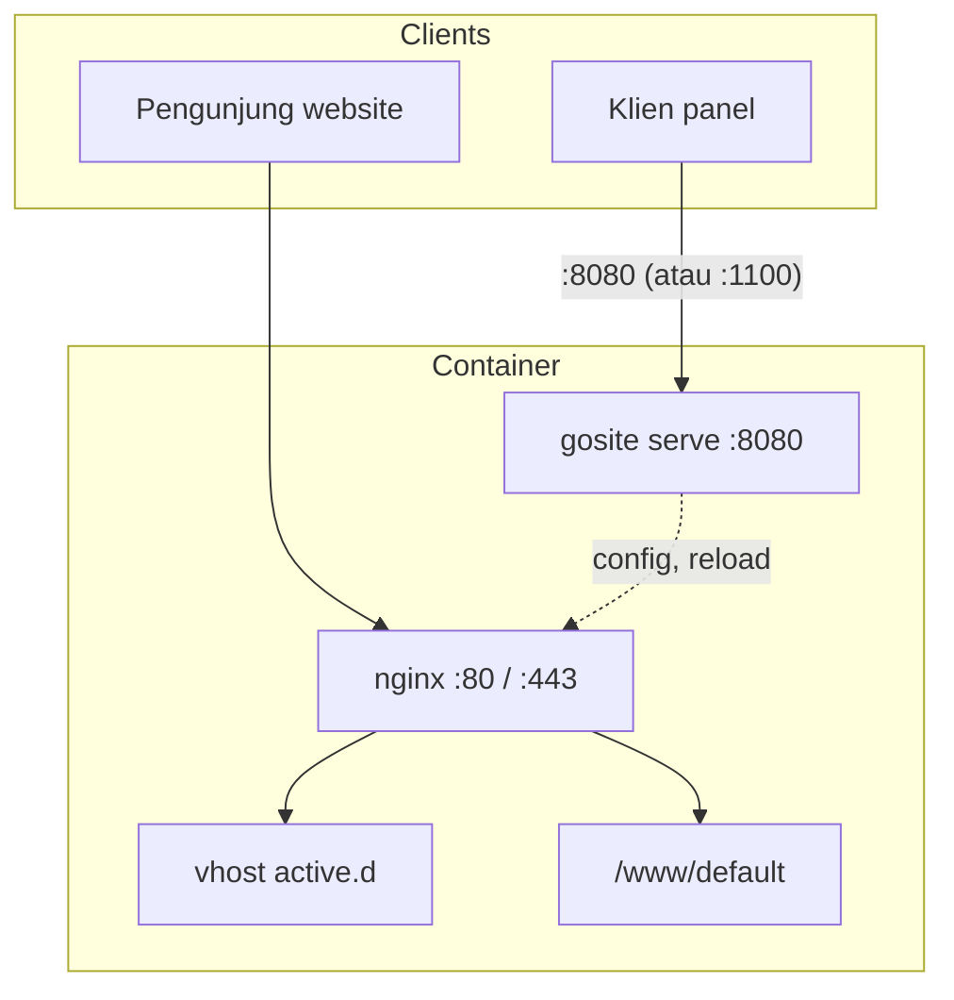

# Sequence: Port panel & TLS (paralel dengan nginx)

GoSite **tidak** mem-proxy traffic panel lewat nginx. Panel listen di **`LISTEN_ADDR` (default `:8080`)** + TLS opsional. Nginx listen **`:80` / `:443`** hanya untuk **website yang dikelola**.

Referensi: komentar `compose.bangunsoft.yml` — `:8080 → panel (independen dari nginx)`.

## GoSite (implementasi)

| Entry publik | Handler | Catatan |
|--------------|---------|---------|
| `https://<host>:8080/` | gosite | SPA + `/api/v1/*` |
| `http(s)://<host>/` pada **:80/:443** | nginx | Welcome atau vhost pelanggan |

`gosite` mengorkestrasi nginx (file vhost, symlink `active.d`, reload) — bukan hop di jalur request website.

### Docker

| File | Panel | Website |
|------|-------|---------|
| `compose.yml` | `8080:8080` | `80:80`, `443:443` |
| `compose.prod.yml` | `1100:8080` | `80`, `443` host mode |

Dev: `make dev-api` → `https://localhost:8080`.

---

## Legacy BangunSite

Go TLS proxy :8080 → Laravel :8000

Proxy Go di `:8080` ke PHP artisan. Nginx tetap terpisah untuk website. GoSite menghapus proxy; panel tetap `:8080`, nginx tetap 80/443.

