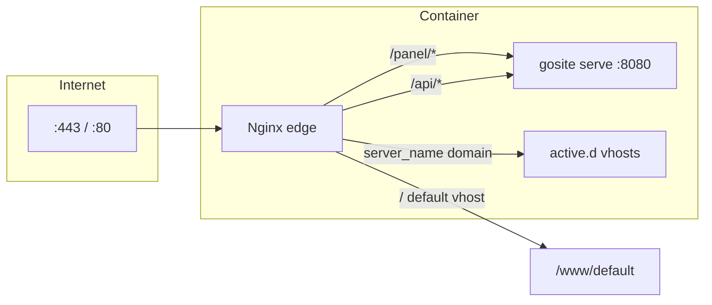

# Sequence: Panel Routing & TLS

GoSite **tidak** memakai binary `server-proxy` terpisah seperti BangunSite legacy. Panel dilayani oleh kombinasi **nginx edge** + **gosite serve**.

## GoSite (implementasi)

| Path publik | Handler | Catatan |
|-------------|---------|---------|
| `/` | nginx default vhost | Welcome page `/www/default` |
| `/panel/` | nginx → gosite | SPA Preact (embed jika `FE_EMBED=true`) |
| `/api/v1/*` | nginx → `http://127.0.0.1:8080` | REST API |
| `https://:8080/health` | gosite langsung | Health check TLS (loopback) |

`gosite serve` listen di `LISTEN_ADDR` (default `:8080`) dengan TLS opsional (`TLS_ENABLE`).

### Middleware di edge

- **HTTP Basic Auth** (`AUTH_ENABLE`) — gate `/api/v1/*` sebelum session
- **Session cookie** — setelah `POST /auth/login`
- Nginx `proxy_ssl_verify off` untuk upstream loopback (container shared network)

### Konfigurasi relevan

| Env | Default | Peran |
|-----|---------|-------|
| `LISTEN_ADDR` | `:8080` | Bind API + SPA |
| `TLS_ENABLE` | `true` | HTTPS pada gosite |
| `FE_EMBED` | `false` | Serve `frontend/dist` dari binary |
| `AUTH_ENABLE` | `true` | Basic auth layer |

Detail URL dev/prod: [README.md](../README.md#verifying-the-production-stack).

---

## Legacy BangunSite

Go TLS proxy :8080 → Laravel :8000

Binary `proxy/main.go` menerima HTTPS di `:8080`, forward ke `http://localhost:8000` (PHP artisan).

| Item | Nilai |
|------|-------|
| Listen | `:8080` |
| Upstream | Laravel :8000 |
| Cert | `/storage/webconfig/ssl/live/default/` |

Digantikan oleh nginx reverse-proxy ke `gosite serve` + TLS langsung di Go.

