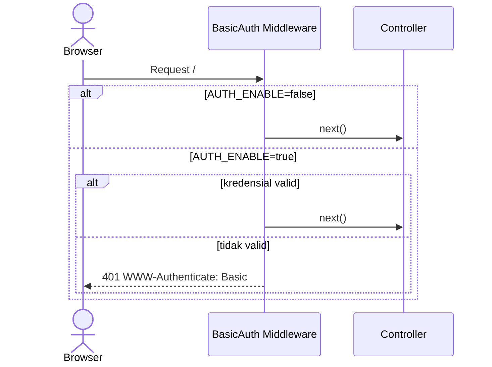
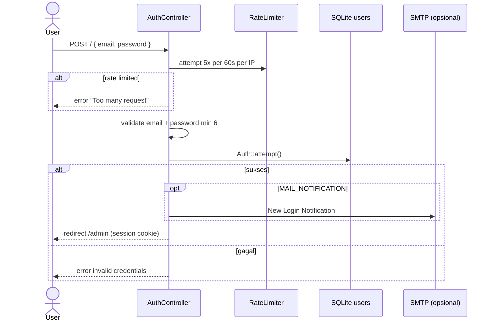
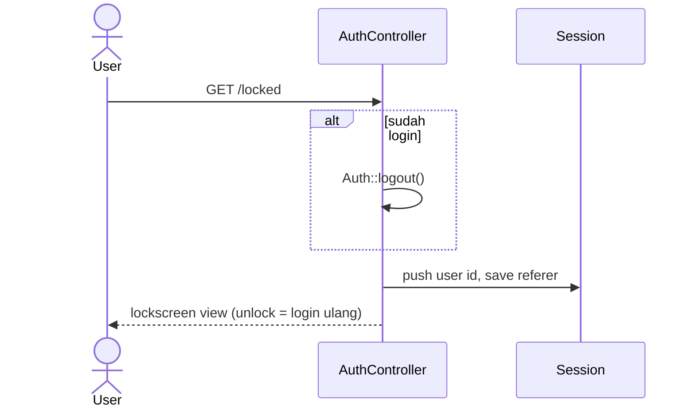

# Sequence: Authentication

Tiga lapisan autentikasi di BangunSite.

## 1. HTTP Basic Auth (opsional)

**Middleware:** `BasicAuth` — aktif jika `AUTH_ENABLE=true`



## 2. Login Laravel

**Routes:** `GET/POST /` (middleware `basic.auth`)



## 3. Lockscreen

**Route:** `GET /locked` — logout tapi simpan user id di session



## Protected routes

Semua `/admin/*` memakai middleware `auth` (Laravel session).

## Implikasi GoSite

| Legacy | GoSite |
|--------|--------|
| PHP session | JWT atau secure HTTP-only cookie session |
| Rate limit | middleware per-IP (redis/in-memory) |
| Basic auth | tetap opsional di reverse proxy atau middleware |
| Lockscreen | state frontend + endpoint re-auth tanpa full logout flow |

**API minimum:**

```
POST /api/v1/auth/login
POST /api/v1/auth/logout
GET  /api/v1/auth/me
POST /api/v1/auth/unlock   # lockscreen
```
