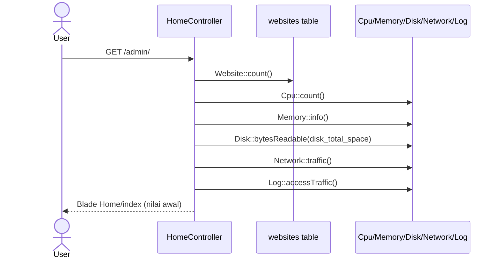
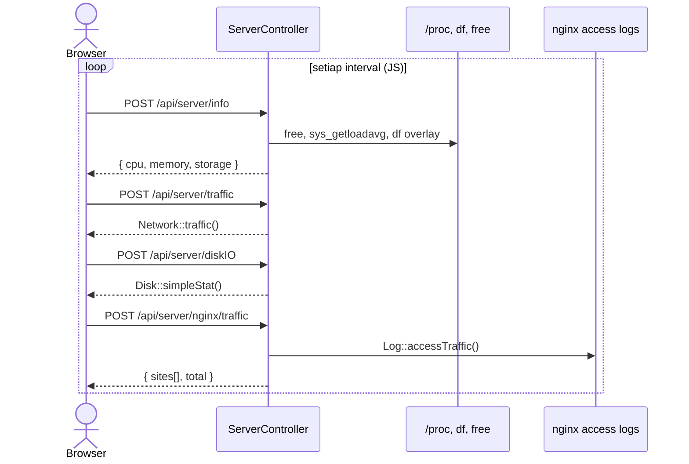

# Sequence: Dashboard & Monitoring

Dashboard menampilkan ringkasan server. Data di-refresh via AJAX ke API internal.

## Initial page load

**Route:** `GET /admin/` → `HomeController@index`

## Polling API (client-side)

**Routes:** `routes/api.php` — saat ini **tanpa auth middleware**

## Data yang dikembalikan

### `/api/server/info`

- `cpu` — load average / core count × 100
- `memory[]` — label, total, used, free (dari `free`)
- `storage` — overlay filesystem dari `df`

### `/api/server/nginx/traffic`

- Per-site request count & bytes dari parse access log
- Total agregat

## Implikasi GoSite

| Endpoint Go | Sumber data |
|-------------|-------------|
| `GET /system/info` | `/proc/loadavg`, `/proc/meminfo`, `df` |
| `GET /system/network` | `/proc/net/dev` |
| `GET /system/disk-io` | iostat atau `/proc/diskstats` |
| `GET /system/nginx-traffic` | parser access log yang sama |

**Penting:** wajib auth di GoSite (legacy endpoint terbuka).

Frontend framework-agnostic: cukup `fetch` interval atau WebSocket push.
