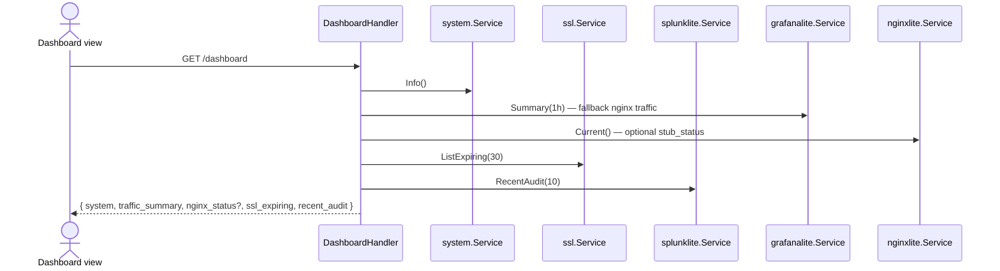

# Sequence: Dashboard & Monitoring

Dashboard menggabungkan snapshot server, traffic, SSL expiry, dan audit feed.

## GoSite (implementation)

### Initial load — aggregated dashboard

**API:** `GET /api/v1/dashboard` (session required)

Response sections:

| Key | Sumber |
|-----|--------|
| `system` | CPU, memory, storage (`/proc`, `df`) |
| `traffic_summary` | Grafana Lite `Summary(1h)` atau fallback `system.NginxTraffic` |
| `nginx_status` | (opsional) stub_status terbaru + `request_rate_per_sec` — lihat [22-nginx-metrics.md](./22-nginx-metrics.md) |
| `ssl_expiring` | Cert expiry ≤ 30 hari |
| `recent_audit` | 10 audit log terakhir |

### Polling detail (opsional)

Frontend can call granular endpoints for live charts:

| Method | Path | Data |
|--------|------|------|
| GET | `/system/info` | CPU, memory, storage |
| GET | `/system/network` | `/proc/net/dev` |
| GET | `/system/disk-io` | disk I/O stats |
| GET | `/system/nginx-traffic` | Parse access log per site |

All endpoints in the **protected** group require session (+ basic auth when enabled).

### Traffic metrics (Grafana Lite)

Chart traffic memakai pre-aggregated buckets — see [18-grafana-lite.md](./18-grafana-lite.md).

Collector runs every 5 minutes in the background (`internal/app/app.go`).

### Nginx metrics (stub_status + VTS)

Real-time connection and per-vhost metrics — see [22-nginx-metrics.md](./22-nginx-metrics.md). Collectors poll localhost every 30 seconds; UI on `/metrics` tab **Nginx** and optional Dashboard cards.

---

## Legacy BangunSite

Blade + POST /api/server/* without auth

- `GET /admin/` render Blade with initial values
- Polling `POST /api/server/info`, `/traffic`, `/diskIO`, `/nginx/traffic` — **without auth middleware** (fixed in GoSite)

## Code

| Paket | Role |
|-------|-------|
| `internal/delivery/http/handler/dashboard.go` | Aggregator |
| `internal/service/system` | Host metrics |
| `internal/observability/grafanalite` | Traffic buckets |
| `internal/observability/nginxlite` | stub_status + VTS samples |
