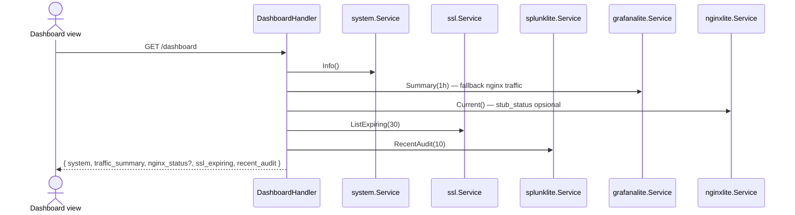

# Sequence: Dashboard & Monitoring

Dashboard menggabungkan snapshot server, traffic, SSL expiry, dan audit feed.

## GoSite (implementasi)

### Initial load — aggregated dashboard

**API:** `GET /api/v1/dashboard` (session required)

Response sections:

| Key | Sumber |
|-----|--------|
| `system` | CPU, memory, storage (`/proc`, `df`) |
| `traffic_summary` | Grafana Lite `Summary(1h)` atau fallback `system.NginxTraffic` |
| `nginx_status` | (opsional) stub_status + `request_rate_per_sec` — [22-nginx-metrics_id.md](./22-nginx-metrics_id.md) |
| `ssl_expiring` | Cert expiry ≤ 30 hari |
| `recent_audit` | 10 audit log terakhir |

### Polling detail (opsional)

Frontend dapat memanggil endpoint granular untuk chart live:

| Method | Path | Data |
|--------|------|------|
| GET | `/system/info` | CPU, memory, storage |
| GET | `/system/network` | `/proc/net/dev` |
| GET | `/system/disk-io` | disk I/O stats |
| GET | `/system/nginx-traffic` | Parse access log per site |

Semua endpoint di grup **protected** — wajib session (+ basic auth jika enabled).

### Traffic metrics (Grafana Lite)

Chart traffic memakai pre-aggregated buckets — lihat [18-grafana-lite.md](./18-grafana-lite.md).

Collector berjalan setiap 5 menit di background (`internal/app/app.go`).

### Metrik nginx (stub_status + VTS)

Koneksi real-time dan per-vhost — lihat [22-nginx-metrics_id.md](./22-nginx-metrics_id.md). Collector poll localhost setiap 30 detik; UI di tab **Nginx** pada `/metrics` dan kartu Dashboard opsional.

---

## Legacy BangunSite

Blade + POST /api/server/* tanpa auth

- `GET /admin/` render Blade dengan nilai awal
- Polling `POST /api/server/info`, `/traffic`, `/diskIO`, `/nginx/traffic` — **tanpa middleware auth** (perbaikan di GoSite)

## Kode

| Paket | Peran |
|-------|-------|
| `internal/delivery/http/handler/dashboard.go` | Aggregator |
| `internal/service/system` | Host metrics |
| `internal/observability/grafanalite` | Traffic buckets |
| `internal/observability/nginxlite` | stub_status + VTS |
