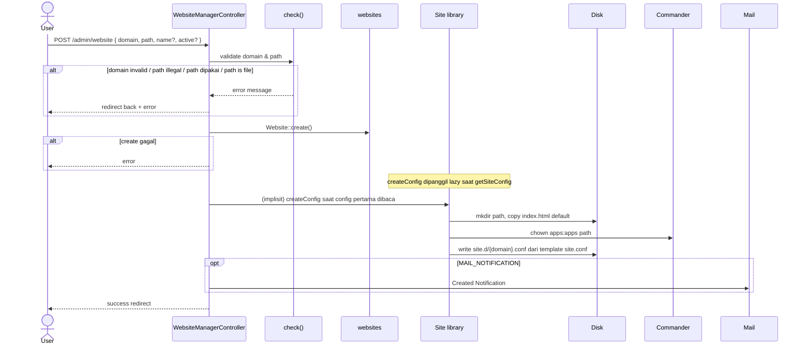
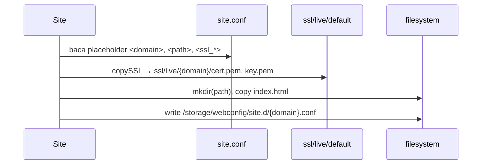

# Sequence: Buat Website

Membuat entri website baru: validasi → simpan DB → generate nginx config → notifikasi email.

**Route:** `POST /admin/website` → `WebsiteManagerController@store`



## createConfig detail

**Library:** `Site::createConfig()`



## Validasi `check()`

| Check | Hasil |
|-------|-------|
| `FILTER_VALIDATE_DOMAIN` | domain valid |
| `Disk::validatePath()` | path aman |
| Path unik di DB | tidak dipakai site lain |
| `is_file(path)` | ditolak |

## Implikasi GoSite

```
POST /api/v1/websites
POST /api/v1/websites/validate   # optional pre-flight
```

Side-effect yang harus di service layer:
1. Insert SQLite
2. Generate `site.d/{domain}.conf`
3. Copy default SSL + index.html
4. **Belum** symlink `active.d` kecuali `active=true` saat create
