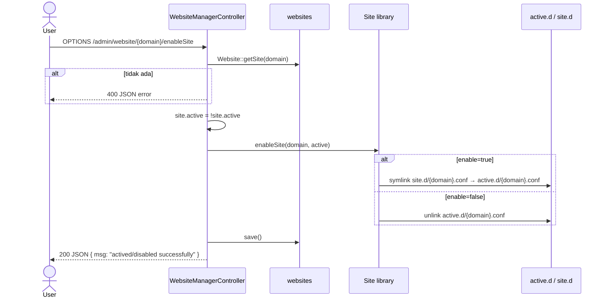

# Sequence: Enable / Disable Website

Toggle website aktif dengan symlink antara `site.d` dan `active.d`, lalu nginx memuat vhost aktif.

**Route:** `OPTIONS /admin/website/{id}/enableSite` → `enableSite()`



## Bagaimana nginx memuat site aktif

```nginx
# nginx.conf
include /storage/webconfig/active.d/*.conf;
```

Hanya file di `active.d/` yang dilayani sebagai vhost tambahan.

## Catatan

- Toggle **tidak** otomatis `nginx reload` di legacy (perlu reload manual atau via config update)
- Di praktik produksi, perubahan `active.d` biasanya butuh `nginx -s reload`

## Implikasi GoSite

```
PATCH /api/v1/websites/{id}/toggle
```

Response:
```json
{ "id": 1, "active": true, "message": "Site actived successfully" }
```

Service harus:
1. Update DB `active`
2. Symlink/unlink
3. **Panggil `nginx reload`** (perbaikan dari legacy)
