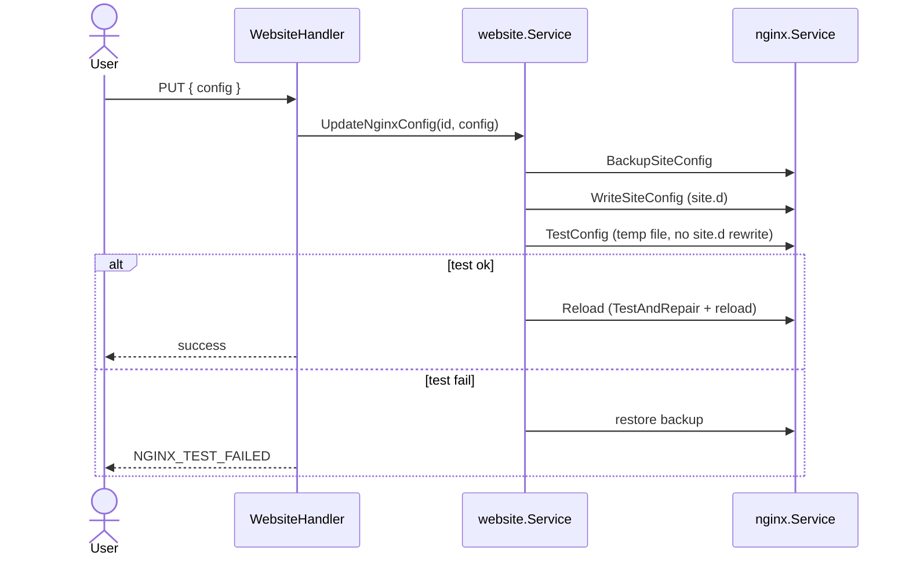

# Sequence: Edit Nginx Config

Three levels of nginx configuration in GoSite.

## A. Config per website

**API:** `PUT /api/v1/websites/{id}/nginx-config`

## B. Default server config

**API:** `GET/PUT /api/v1/nginx/default`  
**File:** `/etc/nginx/http.d/default.conf`

Alur: `TestDefaultConfig` (temp + clone nginx.conf) → write → `Reload`.

## C. Global nginx.conf

**API:** `GET/PUT /api/v1/nginx/global`  
**File:** `/etc/nginx/nginx.conf`

Same: test raw content in temp → write → reload.

## Nginx test per domain (`TestConfig`)

Digunakan oleh: validate website, update site config, create (active).

**Important:** include replacement must use an **absolute** path to the temp file. Replacing only the `site.d/*.conf` glob produces an invalid path (`/storage/webconfig//tmp/...`).

Isolated test file: `config/webconfig/nginx.conf` — loads only one vhost, without `http.d/default.conf`.

## Reload & auto-repair

Every `Reload()` calls `TestAndRepair` on the full production config before `nginx -s reload`. See [nginx-repair.md](../nginx-repair.md).

## API summary

| Method | Path | File target |
|--------|------|-------------|
| PUT | `/websites/{id}/nginx-config` | `site.d/{domain}.conf` |
| GET | `/websites/{id}/nginx-config` | baca `site.d` |
| PUT | `/nginx/default` | `http.d/default.conf` |
| PUT | `/nginx/global` | `nginx.conf` |
| POST | `/nginx/reload` | reload + repair |
| POST | `/nginx/test` | test body arbitrary |

Invariant: **test before apply + rollback on failure** (update site config); **repair + test before reload** (all reloads).
