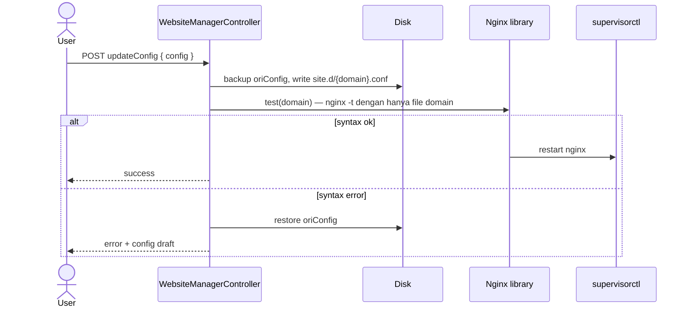
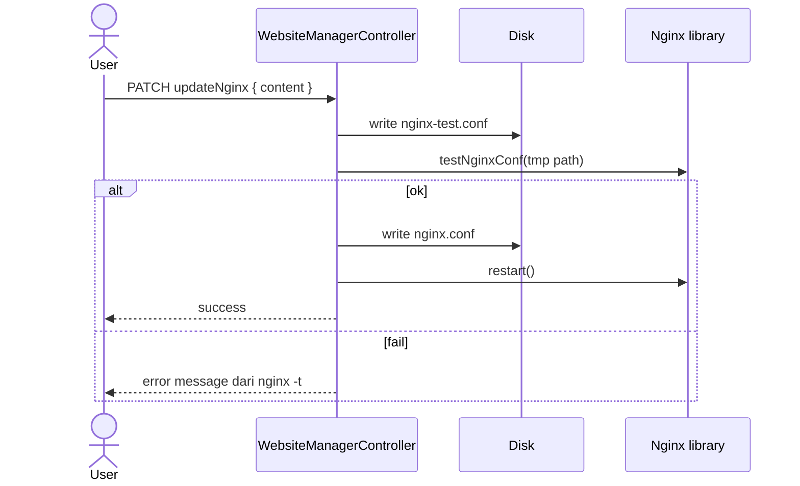

# Sequence: Edit Nginx Config

Tiga level konfigurasi nginx di BangunSite.

## A. Config per website

**Route:** `POST /admin/website/{id}/updateConfig`

## B. Default server config

**Route:** `POST /admin/website/default/updateConfig` (id = `default`)

- Target: `/etc/nginx/http.d/default.conf`
- Sama: test → restart atau rollback

## C. Global nginx.conf

**Route:** `PATCH /admin/website/updateNginx`

## Nginx::test(domain) detail

1. Clone `nginx.conf`, ganti include `site.d/*.conf` → `site.d/{domain}.conf` saja
2. Jalankan `nginx -t -c /tmp/nginx-{time}.conf`
3. Hapus file tmp

## Implikasi GoSite

| Endpoint | File target |
|----------|-------------|
| `PUT /websites/{id}/nginx-config` | `site.d/{domain}.conf` |
| `PUT /nginx/default` | `http.d/default.conf` |
| `PUT /nginx/global` | `nginx.conf` |
| `POST /nginx/test` | body config → `{ ok: true }` atau error |

Invariant: **selalu test sebelum apply + rollback on failure**.
