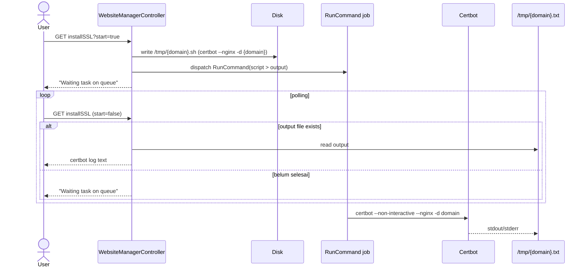
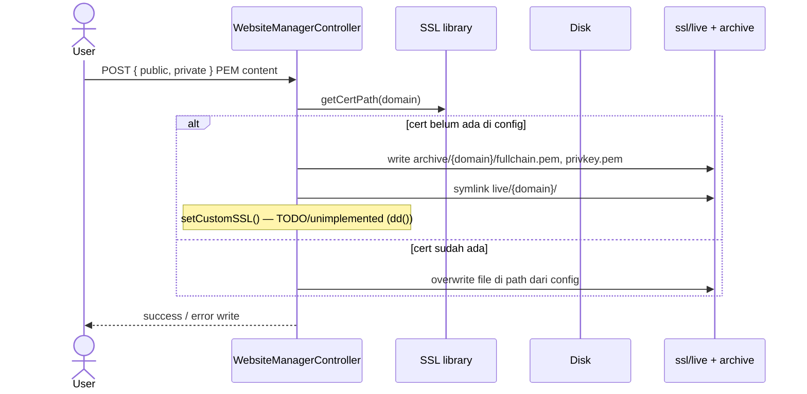

# Sequence: SSL Management

Dua jalur: **Certbot otomatis** dan **upload manual**.

## A. Install SSL via Certbot (async)

**Route:** `GET /admin/website/{id}/installSSL?start=true`



**Command:** `certbot --non-interactive --agree-tos --register-unsafely-without-email --nginx -d {domain}`

## B. Manual SSL upload

**Route:** `POST /admin/website/{id}/updateSSL`



## C. Baca status SSL

**Digunakan di halaman edit:**

- `SSL::readPublic(domain)` / `readPrivate(domain)` — parse path dari `site.d/{domain}.conf`
- `SSL::checkSSL(domain)` — cek directive `ssl_certificate` tidak di-comment

## Renewal otomatis (cron default)

```
certbot renew --post-hook 'supervisorctl restart nginx'
```

Jadwal: cronjob `day` — dijalankan oleh `artisan run:cronjobs`.

## Implikasi GoSite

| Endpoint | Keterangan |
|----------|------------|
| `POST /websites/{id}/ssl/certbot` | Mulai job |
| `GET /websites/{id}/ssl/certbot/stream` | SSE output |
| `PUT /websites/{id}/ssl/manual` | Upload PEM |
| `GET /websites/{id}/ssl` | Status + paths |

Job runner Go menggantikan Laravel Queue + file polling `/tmp/`.

Perbaikan yang disarankan: implement `setCustomSSL` — update directive di `site.d` + reload nginx.
