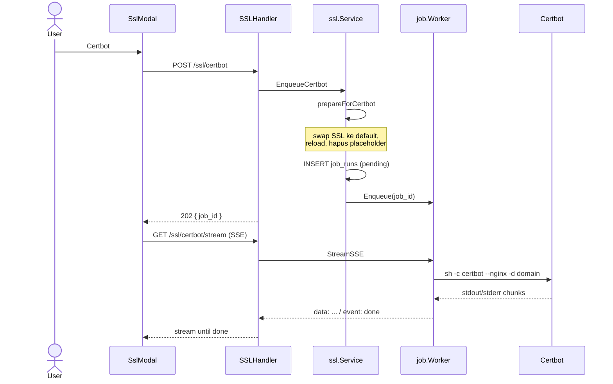
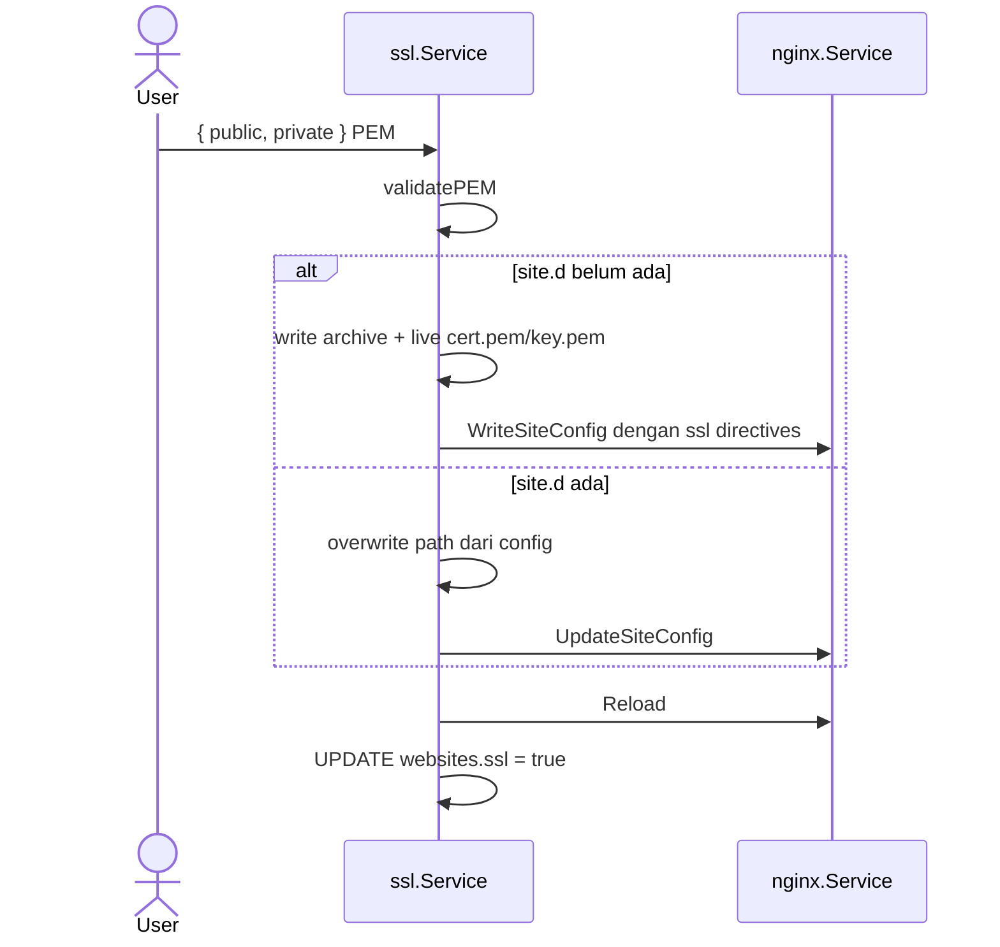

# Sequence: SSL Management

Dua jalur: **Certbot otomatis** (job + SSE) dan **upload manual**.

## Layout filesystem SSL

```
/etc/letsencrypt  →  symlink ke /storage/webconfig/ssl
```

| Path | Isi |
|------|-----|
| `ssl/live/default/cert.pem` | Self-signed boot default |
| `ssl/live/{domain}/cert.pem` | Placeholder saat website create (Gosite) |
| `ssl/live/{domain}/fullchain.pem` | Let's Encrypt (setelah certbot) |
| `ssl/archive/{domain}/` | Archive manual / certbot |

**Konflik umum:** placeholder Gosite (`cert.pem` + `key.pem` sebagai file biasa) memblokir Certbot karena `/etc/letsencrypt/live/{domain}/` sudah ada tetapi bukan lineage LE (`CertStorageError: live directory exists`).

## A. Install SSL via Certbot (async)

**API:**

| Method | Path |
|--------|------|
| POST | `/api/v1/websites/{id}/ssl/certbot` |
| GET | `/api/v1/websites/{id}/ssl/certbot/stream?job_id=` |



### Command

```bash
certbot --non-interactive --agree-tos --register-unsafely-without-email --nginx -d {domain}
```

### `prepareForCertbot` (sebelum job di-queue)

Agar `nginx -t` dan Certbot tidak gagal:

1. Jika `ssl/live/{domain}/` berisi placeholder (`cert.pem` + `key.pem`, tanpa `fullchain.pem` LE):
2. Ganti `ssl_certificate` di `site.d` → path **default** self-signed
3. `UpdateSiteConfig` + `Reload`
4. Hapus direktori `ssl/live/{domain}/` placeholder
5. Baru enqueue Certbot — lineage LE bisa dibuat bersih

Tanpa langkah 2–3, menghapus placeholder saja membuat `nginx -t` gagal (cert path mengarah ke file yang tidak ada).

### Job worker

Sama dengan cron manual run (`internal/infra/job/worker.go`):

- `Enqueue(job_id)` setelah insert DB
- `StreamSSE` poll output sampai `status=ok|failed`
- Event SSE: `data:` lines + `event: done`

## B. Manual SSL upload

**API:** `PUT /api/v1/websites/{id}/ssl/manual`



## C. Status SSL

**API:** `GET /api/v1/websites/{id}/ssl`

Membaca path dari `site.d/{domain}.conf` (`ParseCertPaths`), load PEM dari disk, hitung expiry.

## Renewal otomatis (cron default)

```
certbot renew --post-hook 'nginx -s reload'
```

Dijalankan oleh cron scheduler Go (`run_every: day`), bukan Laravel queue.

## Troubleshooting

| Gejala | Penyebab | Tindakan |
|--------|----------|----------|
| `CertStorageError: live directory exists` | Placeholder Gosite di `live/{domain}` | `prepareForCertbot` (otomatis) atau hapus manual + jalankan certbot lagi |
| Stream putus, `status=pending` | Job tidak di-enqueue ke worker | Pastikan build terbaru (fix `worker.Enqueue`) |
| `nginx -t` gagal sebelum certbot | Cert path mengarah ke file terhapus | `prepareForCertbot` swap ke default dulu |
| Certbot sukses tapi browser warning | Masih self-signed / DNS salah | Cek `ssl_certificate` path di site.d sudah ke `fullchain.pem` |

## API ringkas

| Method | Path |
|--------|------|
| GET | `/websites/{id}/ssl` |
| PUT | `/websites/{id}/ssl/manual` |
| POST | `/websites/{id}/ssl/certbot` |
| GET | `/websites/{id}/ssl/certbot/stream?job_id=` |
