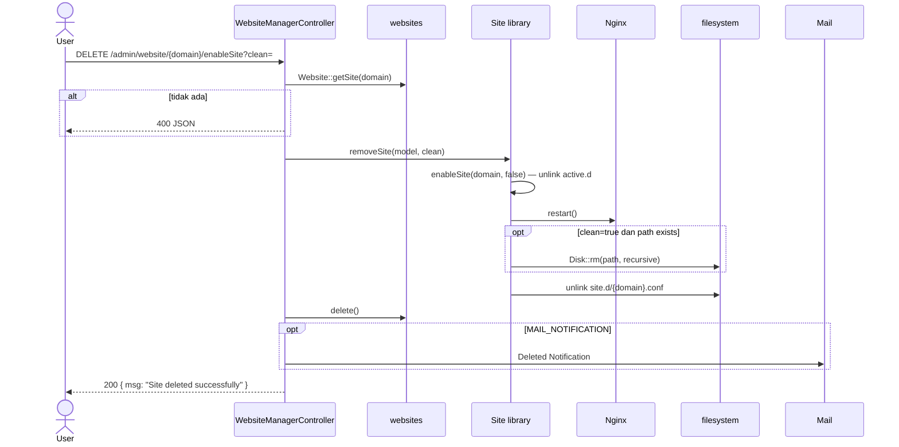

# Sequence: Hapus Website

**Route:** `DELETE /admin/website/{domain}/enableSite` → `destroy()`



## Parameter `clean`

| clean | Efek |
|-------|------|
| true / ada | Hapus document root (`path`) rekursif |
| false / null | Hanya hapus config & DB, biarkan files |

## Yang dihapus

1. Symlink `active.d/{domain}.conf`
2. File `site.d/{domain}.conf`
3. Record SQLite
4. (Opsional) folder `/www/...`

**Tidak dihapus otomatis:** sertifikat SSL di `ssl/live/{domain}/`, log files.

## Implikasi GoSite

```
DELETE /api/v1/websites/{id}?clean=true
```

Urutan aman:
1. Disable site
2. Nginx reload
3. Hapus config files
4. Hapus path jika diminta
5. Hapus DB record

Pertimbangkan konfirmasi UI untuk `clean=true`.
