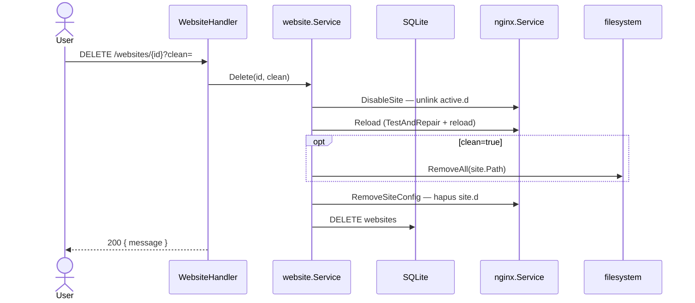

# Sequence: Hapus Website

**API:** `DELETE /api/v1/websites/{id}?clean=true|false`

## GoSite (implementasi)

### Parameter `clean`

| clean | Efek |
|-------|------|
| `true` | Hapus document root (`path`) rekursif |
| `false` / omitted | Biarkan folder `/www/...`, hapus config + DB saja |

UI menampilkan konfirmasi sebelum delete.

### Yang dihapus

1. Symlink `active.d/{domain}.conf`
2. File `site.d/{domain}.conf`
3. Record SQLite

### Yang tidak dihapus otomatis

- Sertifikat `ssl/live/{domain}/`
- File log `access-{domain}.log`, `error-{domain}.log`

### Urutan aman

1. Disable + reload nginx (vhost tidak lagi aktif)
2. Hapus path jika `clean=true`
3. Hapus `site.d` config
4. Hapus baris DB

Reload memakai [nginx auto-repair](../nginx-repair_id.md) jika config lain rusak.

---

## Legacy BangunSite

**Route:** `DELETE /admin/website/{domain}/enableSite`

Legacy bug: parameter `clean` pernah selalu dianggap true — di GoSite `clean` eksplisit via query string.

Regression test: `internal/regression/legacy_bugs_test.go` — `Delete clean=false` keeps files.
