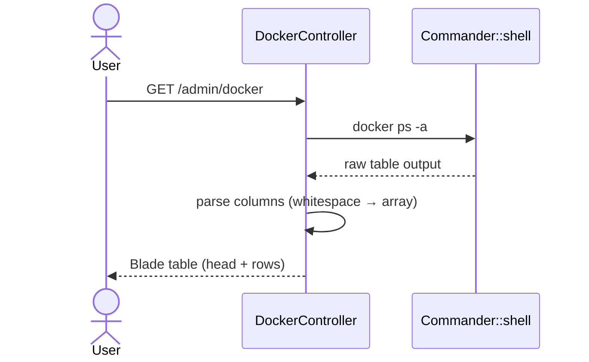
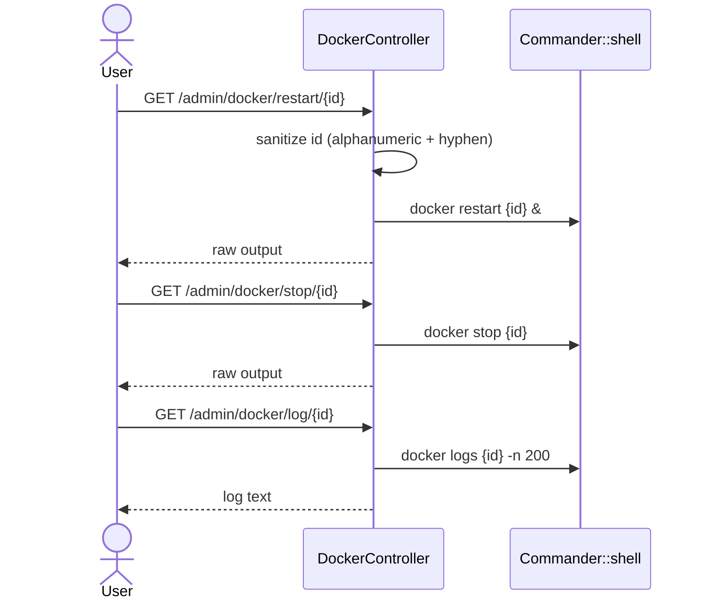

# Sequence: Docker Management

Mengelola container via Docker socket yang di-mount ke container BangunSite.

**Akses:** `/var/run/docker.sock` (container `privileged: true`)

## List containers

**Route:** `GET /admin/docker`



## Restart / stop / logs



## Keamanan legacy

- ID disanitize regex `/[^a-zA-Z0-9\-]/`
- Aksi via **GET** (seharusnya POST di GoSite)
- Tidak ada filter container — akses penuh ke semua container di host

## Implikasi GoSite

```
GET  /api/v1/docker/containers
POST /api/v1/docker/containers/{id}/restart
POST /api/v1/docker/containers/{id}/stop
GET  /api/v1/docker/containers/{id}/logs?tail=200
```

Pertimbangan:
- Gunakan Docker Engine API (HTTP via socket) daripada parse CLI
- Optional: filter container by label
- Role-based: hanya admin boleh restart/stop
