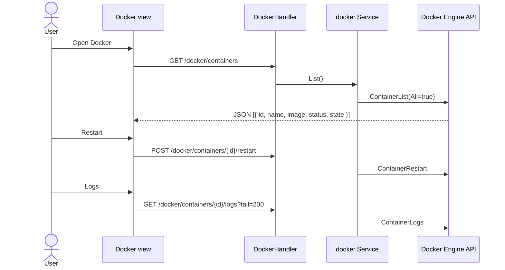

# Sequence: Docker Management

Manage containers via **Docker Engine API** (`/var/run/docker.sock`).

## GoSite (implementation)

**Package:** `internal/infra/docker` (official SDK) → `internal/service/docker`

### API

| Method | Path |
|--------|------|
| GET | `/api/v1/docker/containers` |
| POST | `/api/v1/docker/containers/{id}/restart` |
| POST | `/api/v1/docker/containers/{id}/stop` |
| GET | `/api/v1/docker/containers/{id}/logs?tail=` |

### Security

- Container ID is sanitized (`^[a-zA-Z0-9-]+$`)
- Destructive actions via **POST** (not legacy GET)
- Session + basic auth required
- When socket unavailable → `NoopClient` (empty list, no crash)

### Fallback

`dockerinfra.NoopClient` is used when `NewClient()` fails (dev without socket).

---

## Legacy BangunSite

Parse output `docker ps` CLI

- `GET /admin/docker/restart/{id}` — aksi via GET
- Parse whitespace from stdout `docker ps -a`

## Code

| File | Role |
|------|-------|
| `internal/infra/docker/client.go` | Engine API wrapper |
| `internal/delivery/http/handler/docker.go` | HTTP handlers |
