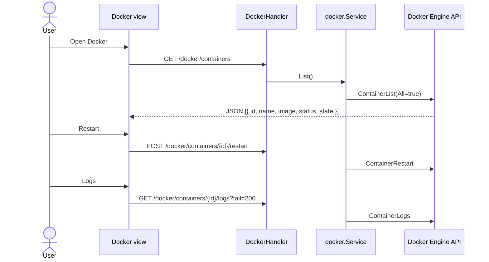

# Sequence: Docker Management

Kelola container via **Docker Engine API** (`/var/run/docker.sock`).

## GoSite (implementasi)

**Paket:** `internal/infra/docker` (official SDK) → `internal/service/docker`

### API

| Method | Path |
|--------|------|
| GET | `/api/v1/docker/containers` |
| POST | `/api/v1/docker/containers/{id}/restart` |
| POST | `/api/v1/docker/containers/{id}/stop` |
| GET | `/api/v1/docker/containers/{id}/logs?tail=` |

### Keamanan

- Container ID disanitize (`^[a-zA-Z0-9-]+$`)
- Aksi destruktif via **POST** (bukan GET legacy)
- Session + basic auth required
- Jika socket tidak tersedia → `NoopClient` (list kosong, tidak crash)

### Fallback

`dockerinfra.NoopClient` dipakai saat `NewClient()` gagal (dev tanpa socket).

---

## Legacy BangunSite

Parse output `docker ps` CLI

- `GET /admin/docker/restart/{id}` — aksi via GET
- Parse whitespace dari stdout `docker ps -a`

## Kode

| File | Peran |
|------|-------|
| `internal/infra/docker/client.go` | Engine API wrapper |
| `internal/delivery/http/handler/docker.go` | HTTP handlers |
