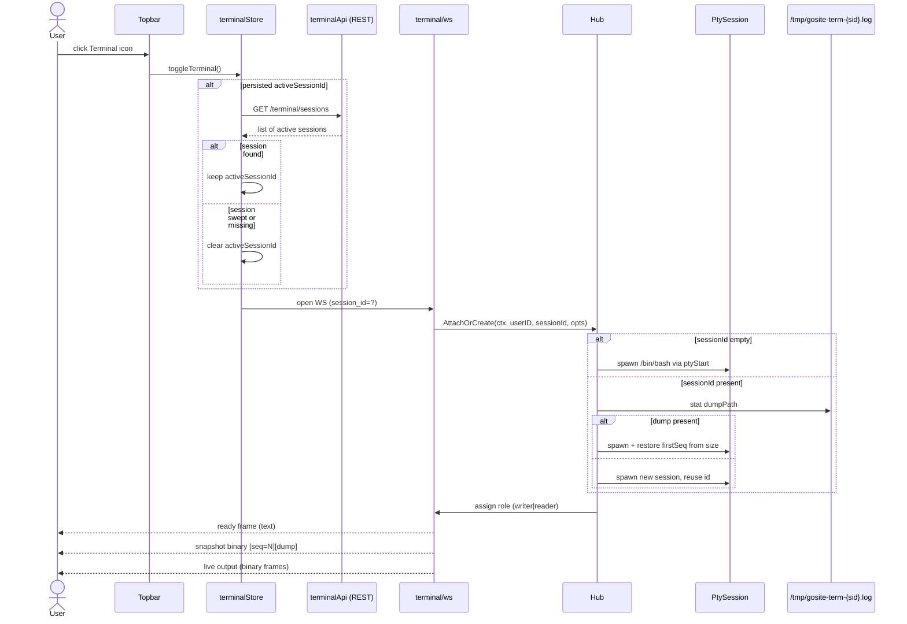
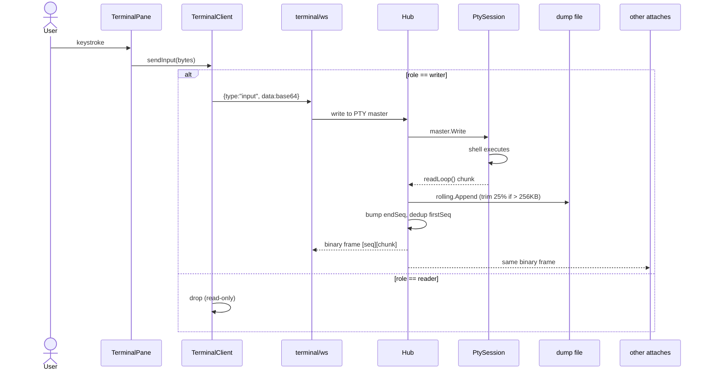
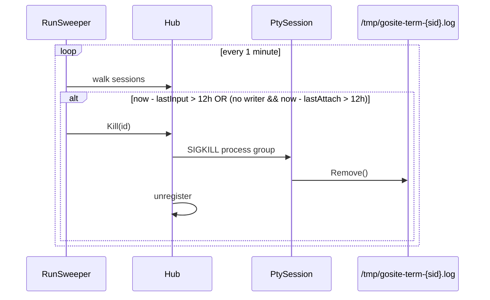
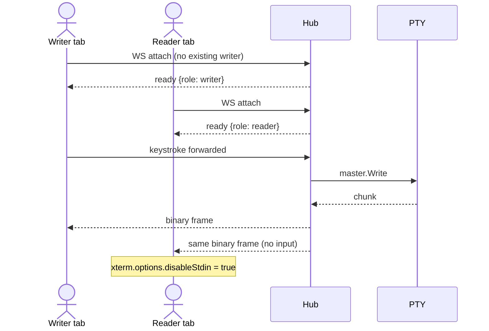

# Sequence: Floating Terminal Session

What happens when the user clicks the topbar Terminal icon, types into the
xterm pane, and (optionally) refreshes or kills the session.

**Entry points:** topbar icon click → `terminalStore.toggleTerminal()` →
WebSocket upgrade at `/api/v1/terminal/ws?session_id=...`.

## Initial attach (no active session)



## Writer input → PTY → broadcast



## Refresh / reconnect (no kill)

```mermaid
sequenceDiagram
    actor User
    participant Browser
    participant Store as terminalStore
    participant API as terminalApi
    participant WS as terminal/ws
    participant Hub
    participant FS as dump file

    User->>Browser: click Terminal icon after refresh
    Store->>API: GET /terminal/sessions
    API-->>Store: list
    Store->>Store: validate persisted activeSessionId
    Store->>WS: open WS ?session_id=...
    WS->>Hub: AttachOrCreate
    Hub-->>WS: ready frame {first_seq, end_seq, role}
    WS-->>Browser: snapshot binary [seq=first][dump]
    Browser->>Browser: dedup any chunk with seq <= lastReceivedSeq
    Note over Hub,FS: PTY is the same process; no spawn unless restart lost dump
```

## Server restart with `/tmp` mounted

```mermaid
sequenceDiagram
    participant Docker
    participant Hub
    participant FS as /tmp/gosite-term-{sid}.log
    participant PTY as new PtySession

    Docker->>Hub: container restart
    Note over Hub: in-memory registry cleared
    User->>Hub: open WS ?session_id=abc
    Hub->>FS: stat dumpPath
    FS-->>Hub: size=4096
    Hub->>PTY: spawn /bin/bash, FirstSeq=4096
    PTY-->>Hub: ready frame {first_seq:4096, end_seq:4096}
    Hub-->>User: snapshot binary [seq=4096][dump]
    Note over PTY: previous shell process is gone; this is a fresh shell<br/>but the scrollback survives via the rolling dump.
```

## Sweeper kill (12h idle)



## Multi-attach (1 writer + N readers)



## Configuration knobs

| Env var                 | Default  | Description                                  |
|-------------------------|----------|----------------------------------------------|
| `TERMINAL_STICKY_TTL`   | `12h`    | Time without input/attach before sweeper kill |
| `TERMINAL_DUMP_DIR`     | `/tmp`   | Rolling dump location (host-mount for restart survival) |
| `TERMINAL_DUMP_MAX`     | `262144` | Cap (bytes) before oldest 25% is dropped     |
| `TERMINAL_PER_USER_MAX` | `8`      | Maximum concurrent sessions per user          |
