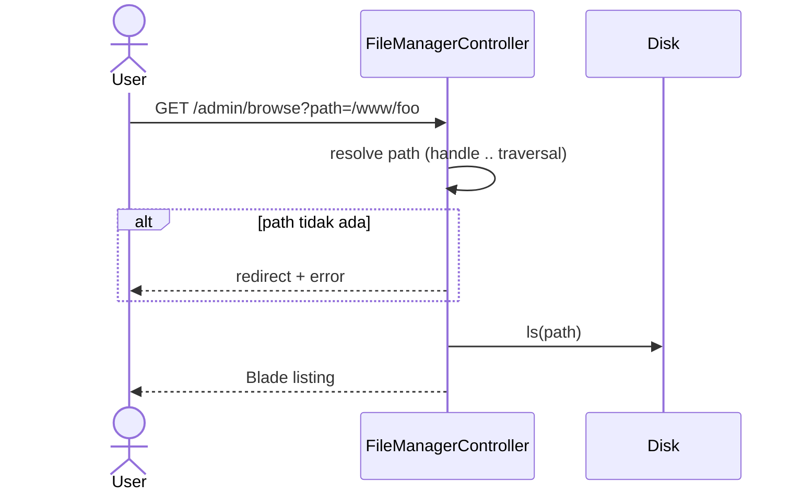
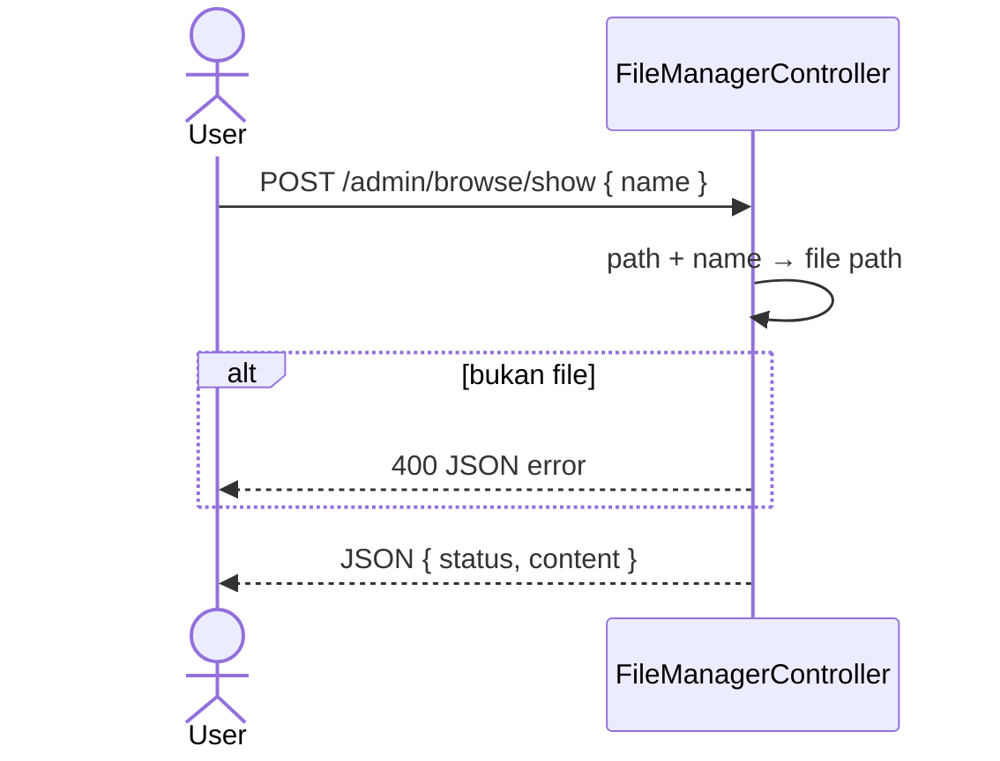
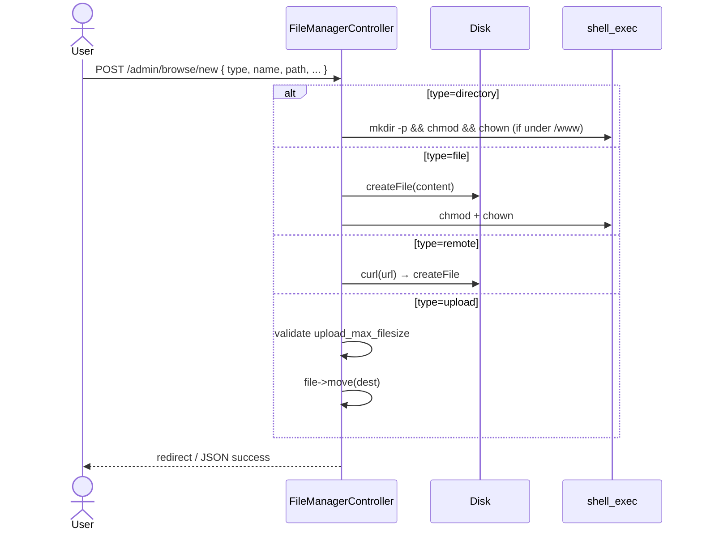
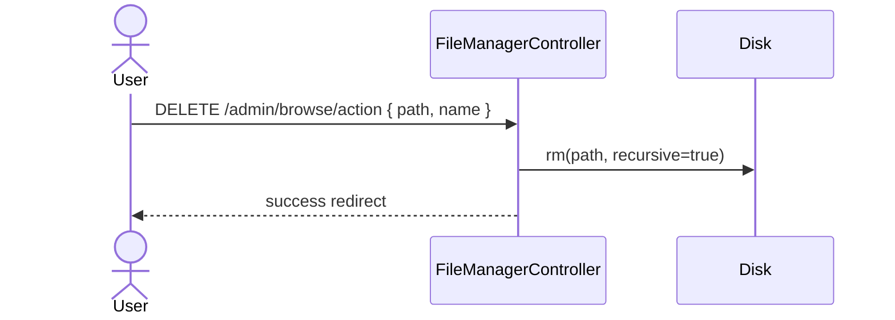

# Sequence: File Manager

Browser dan manipulasi file di server. Default root: `WEB_PATH` (`/www`).

**Base route:** `/admin/browse`

## Browse directory

## Read file content

## Create (directory / file / remote / upload)

## Actions: chmod, copy, execute

| type | Aksi |
|------|------|
| chmod | `chmod {perm} {path}` — validasi 600–777 |
| copy | `Disk::cp` ke `toPath`, mkdir jika perlu |
| execute | `nohup {path} &` — butuh permission ≥ 775, bukan folder |

## Delete

## Implikasi GoSite

| Endpoint | Catatan |
|----------|---------|
| `GET /files?path=` | Listing dengan metadata (name, size, perm, is_dir) |
| `GET /files/content` | Baca teks/binary base64 |
| `POST /files` | Multipart upload |
| `POST /files/actions` | chmod, copy, execute |
| `DELETE /files` | Hapus |

**Keamanan wajib:**
- Allowlist root: `/www`, `/storage`, `/tmp` (konfigurasi)
- Tolak `..` dan path absolut di luar allowlist
- Execute command: sangat terbatas atau dinonaktifkan di produksi
