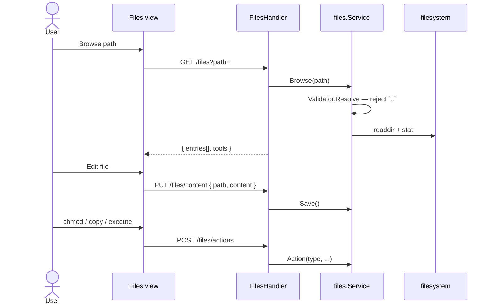

# Sequence: File Manager

Browse and manipulate files within **allowlisted roots**.

## GoSite (implementation)

**Default roots:** `["/"]` (entire container filesystem — restrict in production via config)

**Package:** `internal/service/files` + `internal/infra/filesystem.Validator`

### API

| Method | Path | Purpose |
|--------|------|--------|
| GET | `/files?path=` | Listing + metadata (mime, editable, archive) |
| GET | `/files/content?path=` | Read text |
| GET | `/files/raw?path=` | Download binary |
| PUT | `/files/content` | Save text |
| POST | `/files` | Create file/dir, multipart upload, URL import |
| POST | `/files/actions` | `chmod`, `copy`, `execute` |
| POST | `/files/batch-save` | Multi-file save |
| POST | `/files/batch-delete` | Multi-file delete |
| DELETE | `/files?path=` | Delete file/dir |

### Actions

| type | Behavior |
|------|----------|
| `chmod` | `chmod` via command runner |
| `copy` | Copy to destination path |
| `execute` | Run script — only when `FILES_ALLOW_EXECUTE=true` |

### Security

- `filesystem.Validator` — resolve path, reject traversal outside roots
- Execute disabled by default (`FILES_ALLOW_EXECUTE=false`)
- Archive extract (zip/tar) when tools are available on the host

### Entry metadata

Each entry includes: `kind`, `mime_type`, `editable`, `viewable`, `archive`, `symlink`, `target`.

---

## Legacy BangunSite

/admin/browse Blade UI

Default root `WEB_PATH` (`/www`). chown/chmod via shell for paths under `/www`.

## Code

| File | Role |
|------|-------|
| `internal/infra/filesystem/pathutil.go` | Path validation |
| `internal/delivery/http/handler/files.go` | Multipart upload, batch ops |
