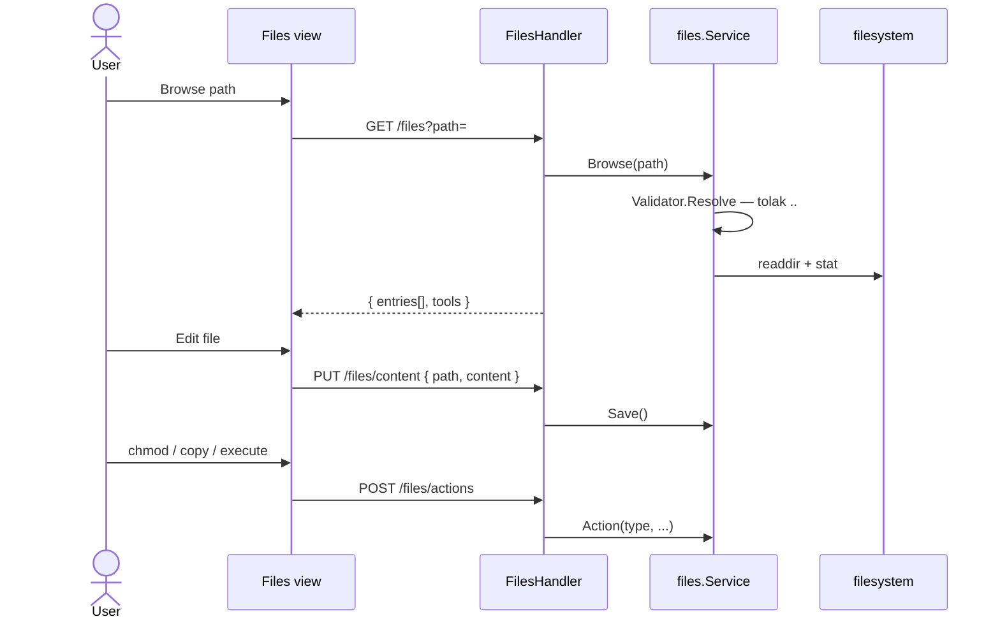

# Sequence: File Manager

Browse dan manipulasi file dalam **allowlist root**.

## GoSite (implementasi)

**Default roots:** `["/"]` (seluruh filesystem container — production harus dibatasi via config)

**Paket:** `internal/service/files` + `internal/infra/filesystem.Validator`

### API

| Method | Path | Fungsi |
|--------|------|--------|
| GET | `/files?path=` | Listing + metadata (mime, editable, archive) |
| GET | `/files/content?path=` | Baca teks |
| GET | `/files/raw?path=` | Download binary |
| PUT | `/files/content` | Simpan teks |
| POST | `/files` | Buat file/dir, upload multipart, import URL |
| POST | `/files/actions` | `chmod`, `copy`, `execute` |
| POST | `/files/batch-save` | Multi-file save |
| POST | `/files/batch-delete` | Multi-file delete |
| DELETE | `/files?path=` | Hapus file/dir |

### Actions

| type | Perilaku |
|------|----------|
| `chmod` | `chmod` via command runner |
| `copy` | Salin ke path tujuan |
| `execute` | Jalankan script — hanya jika `FILES_ALLOW_EXECUTE=true` |

### Keamanan

- `filesystem.Validator` — resolve path, tolak traversal di luar roots
- Execute dinonaktifkan default (`FILES_ALLOW_EXECUTE=false`)
- Archive extract (zip/tar) jika tool tersedia di host

### Entry metadata

Setiap entry menyertakan: `kind`, `mime_type`, `editable`, `viewable`, `archive`, `symlink`, `target`.

---

## Legacy BangunSite

/admin/browse Blade UI

Default root `WEB_PATH` (`/www`). chown/chmod via shell untuk path di bawah `/www`.

## Kode

| File | Peran |
|------|-------|
| `internal/infra/filesystem/pathutil.go` | Path validation |
| `internal/delivery/http/handler/files.go` | Multipart upload, batch ops |
