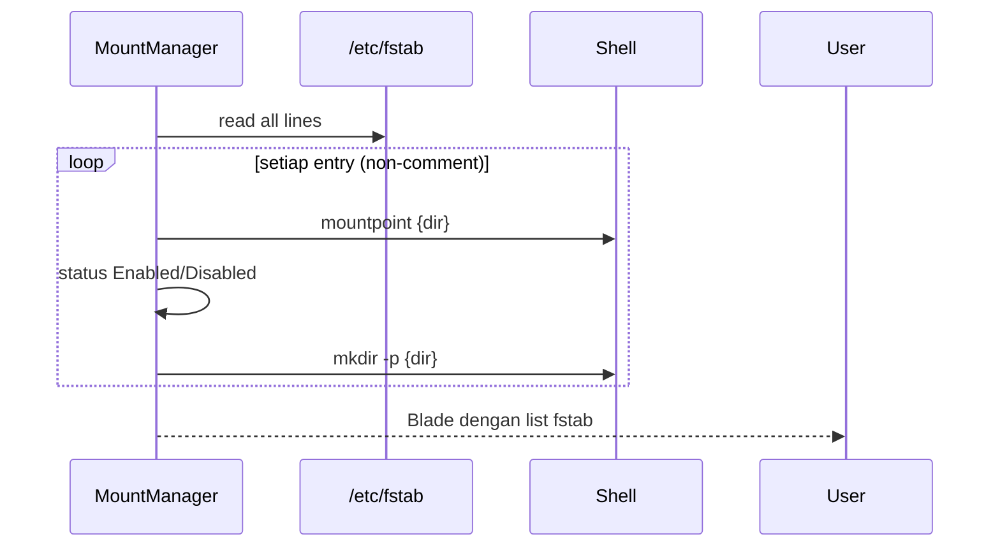
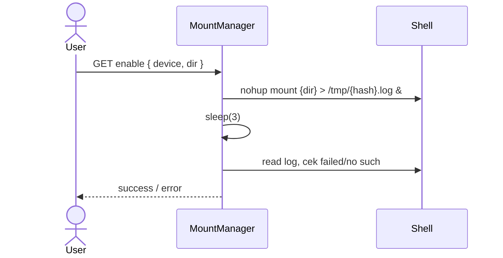
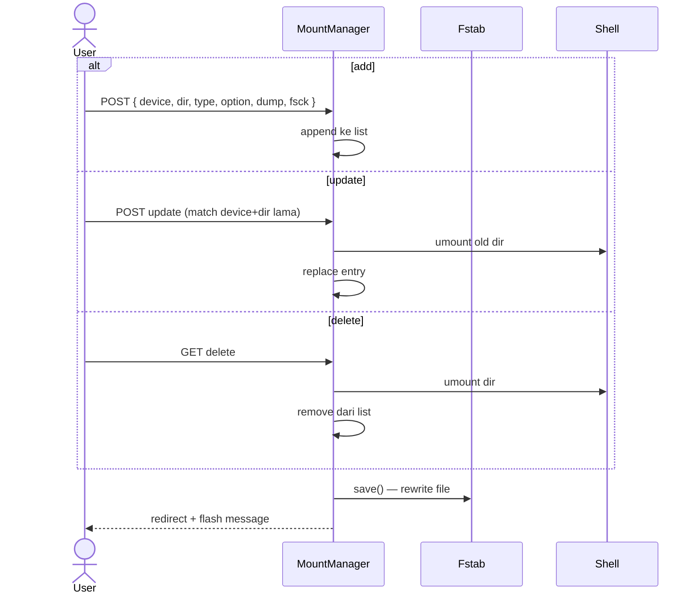

# Sequence: Mount Manager

Kelola `/etc/fstab` (symlink ke `/storage/fstab`) dan mount/umount filesystem.

## List mounts

**Route:** `GET /admin/mount`



## Enable mount

**Route:** `GET /admin/mount/enable?device=&dir=`



## Add / update / delete



## Startup integration

`config/fstab_mounter.sh` dijalankan saat container start — mount semua entry fstab.

## Implikasi GoSite

```
GET    /api/v1/mounts
POST   /api/v1/mounts
PUT    /api/v1/mounts
DELETE /api/v1/mounts
POST   /api/v1/mounts/enable
```

Validasi:
- Format fstab (6 kolom)
- Device path exists atau remote valid
- Tidak allow mount sensitif tanpa konfirmasi
