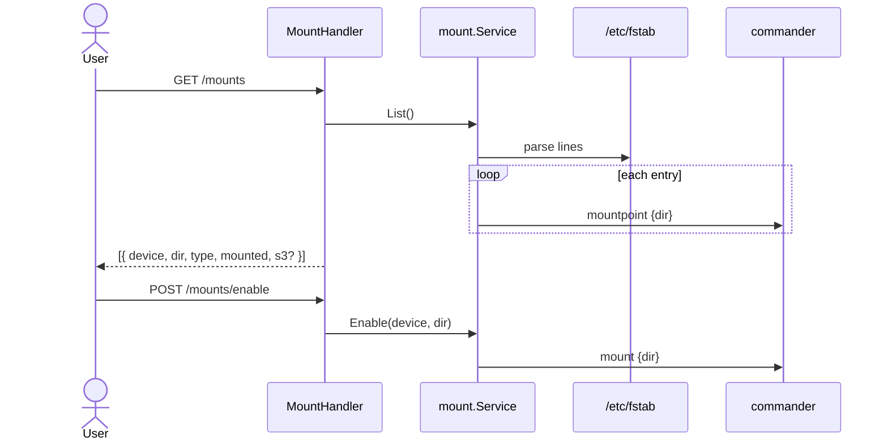

# Sequence: Mount Manager

Kelola `/etc/fstab` (symlink → `/storage/fstab`) dan mount/umount.

## GoSite (implementasi)

**Paket:** `internal/service/mount`

### API

| Method | Path |
|--------|------|
| GET | `/api/v1/mounts` |
| POST | `/api/v1/mounts` |
| PUT | `/api/v1/mounts` |
| DELETE | `/api/v1/mounts` |
| POST | `/api/v1/mounts/enable` |

### fstab & secrets

| Path | Peran |
|------|-------|
| `/etc/fstab` | Symlink ke `/storage/fstab` |
| `/storage/mount-secrets/` | Kredensial S3 (jika entry type s3fs) |

Entry JSON dapat menyertakan blok `s3` (endpoint, bucket, keys) — disimpan terpisah dari fstab line.

### Startup

`config/start.sh` → `/run/fstab_mounter.sh` mount semua entry saat boot.

### Validasi

- Format fstab 6 kolom
- Device + dir required pada create/update
- Umount sebelum update/delete entry

---

## Legacy BangunSite

GET untuk enable/delete

- Enable via `GET /admin/mount/enable?device=&dir=`
- Async mount log di `/tmp/{hash}.log`

GoSite memakai POST dan response JSON langsung.

## Kode

| File | Peran |
|------|-------|
| `internal/service/mount/service.go` | fstab CRUD, mount ops |
| `internal/delivery/http/handler/mount.go` | HTTP |
