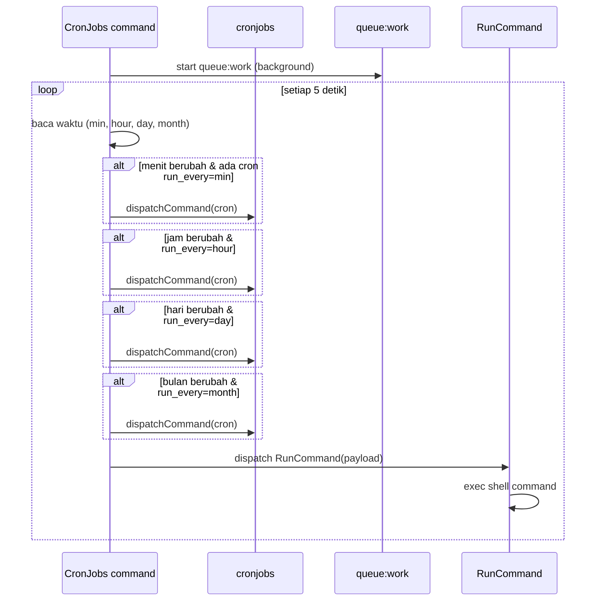
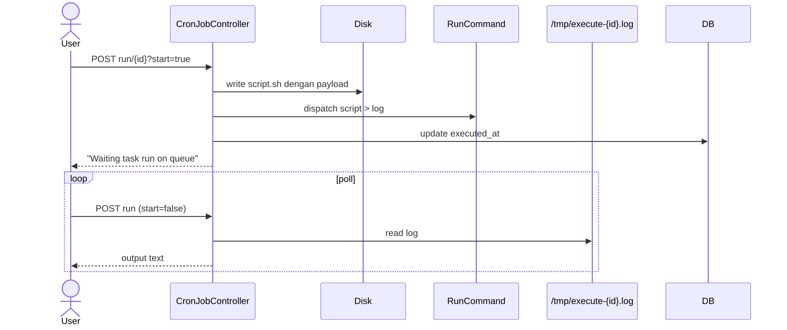

# Sequence: Cron Jobs

Dua jalur: **scheduler otomatis** (daemon) dan **manual run** dari UI.

## Scheduler daemon

**Proses:** `php artisan run:cronjobs` (supervisor program `crond`)



## CRUD dari UI

**Routes:** `/admin/cronjob` resource

| Aksi | Route |
|------|-------|
| List | GET index |
| Create | POST store |
| Update | PUT/PATCH update |
| Delete | DELETE destroy |

## Manual run (async polling)

**Route:** `POST /admin/cronjob/run/{id}`



## Default cron: Let's Encrypt

```sql
payload: certbot renew --post-hook 'supervisorctl restart nginx'
run_every: day
```

## Implikasi GoSite

```
GET    /api/v1/cronjobs
POST   /api/v1/cronjobs
PUT    /api/v1/cronjobs/{id}
DELETE /api/v1/cronjobs/{id}
POST   /api/v1/cronjobs/{id}/run
```

Arsitektur Go:
- **Scheduler goroutine** dengan ticker + evaluasi `run_every`
- **Worker pool** untuk eksekusi command (timeout 300s seperti legacy)
- SSE untuk output manual run & certbot

Pertimbangan keamanan: whitelist command atau require admin approval untuk payload berbahaya.
