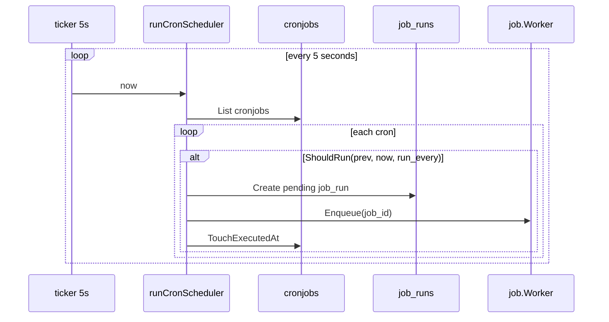
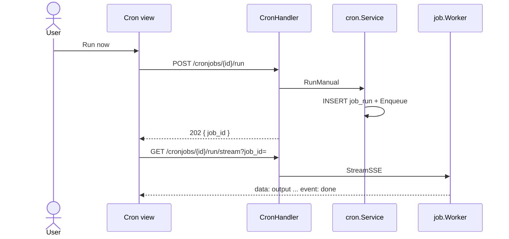

# Sequence: Cron Jobs

Scheduler otomatis + manual run dengan **SSE stream**.

## GoSite (implementasi)

### Scheduler (background)

**Lokasi:** `internal/app/scheduler.go` — goroutine di `gosite serve`



`ShouldRun` (`internal/service/cron/service.go`):

| run_every | Trigger |
|-----------|---------|
| `min` | Menit berganti |
| `hour` | Jam berganti |
| `day` | Hari berganti |
| `month` | Bulan berganti |

### Worker

Sama dengan Certbot — `internal/infra/job/worker.go`:

1. `MarkRunningWithOutput`
2. `sh -c {payload}` dengan streaming stdout/stderr
3. `Complete` status `ok` / `failed`

2 worker goroutines (buffer 32).

### CRUD

| Method | Path |
|--------|------|
| GET | `/api/v1/cronjobs` |
| POST | `/api/v1/cronjobs` |
| PUT | `/api/v1/cronjobs/{id}` |
| DELETE | `/api/v1/cronjobs/{id}` |

### Manual run + SSE



Frontend: `web/src/lib/sse.ts` + `JobStreamModal`.

### Default seed

```text
certbot renew --post-hook 'nginx -s reload'
run_every: day
```

### Keamanan

Payload dijalankan sebagai shell command — pertimbangkan allowlist di produksi. Hanya user dengan session panel.

---

## Legacy BangunSite

<details>
<summary>PHP artisan run:cronjobs + Laravel queue</summary>

- Proses supervisor terpisah `crond`
- Manual run polling file `/tmp/execute-{id}.log`

</details>

## Kode

| File | Peran |
|------|-------|
| `internal/app/scheduler.go` | Auto dispatch |
| `internal/infra/job/worker.go` | Exec + StreamSSE |
| `internal/delivery/http/handler/cron.go` | Run + RunStream |
