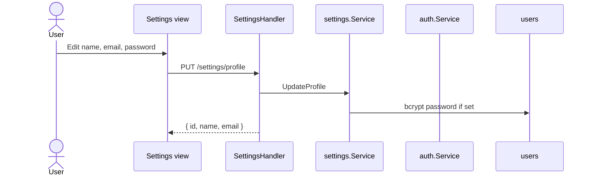

# Sequence: Settings

GoSite only implements **user profile update**. Legacy PHP/FPM modules are not ported.

## GoSite (implementation)

### API

| Method | Path | Status |
|--------|------|--------|
| PUT | `/api/v1/settings/profile` | ✅ Implemented |

Current user profile is read via `GET /auth/me`.

### Validation

- Name & email required
- Password optional; minimum 6 characters when set
- bcrypt hash (compatible Laravel `$2y$` prefix)

---

## Legacy BangunSite (not ported)

PHP ini, php-fpm, pool editor

| Legacy route | GoSite |
|--------------|--------|
| `POST /admin/setting/update/php` | ❌ Dropped — panel without PHP |
| `POST /admin/setting/update/fpm` | ❌ Dropped |
| `POST /admin/setting/update/pool` | ❌ Dropped |

Legacy BangunSite edited `/storage/php/*`. GoSite container does not run PHP-FPM for the panel.

## Code

| File | Role |
|------|-------|
| `internal/service/settings/service.go` | UpdateProfile |
| `internal/delivery/http/handler/settings.go` | HTTP |

UI hints: `GET /ui/meta` → section settings labels.
