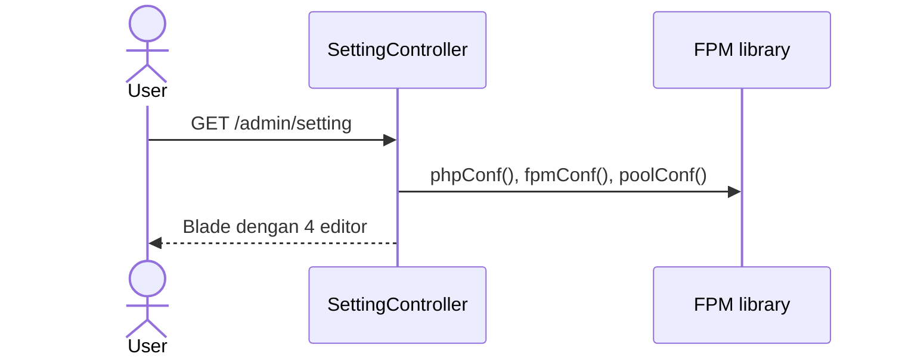
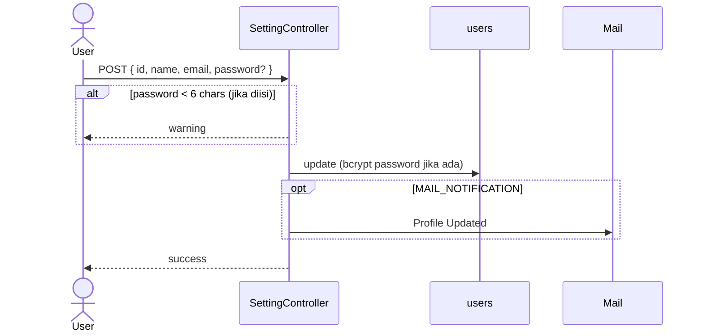
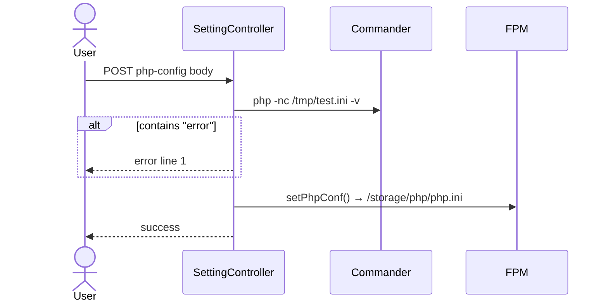

# Sequence: Settings

Empat area: **profil user**, **php.ini**, **php-fpm.conf**, **www pool**.

**Route:** `GET /admin/setting`

## Load settings page



## Update profile

**Route:** `POST /admin/setting/update/profile`



## Update PHP config

**Route:** `POST /admin/setting/update/php`



## Update FPM & pool

Sama pola:
- `php-fpm -ny /tmp.conf -t` validasi
- Tulis ke `php-fpm.conf` atau `php-fpm.d/www.conf`

**Catatan:** Perubahan FPM/pool tidak auto-restart php-fpm di legacy — pertimbangkan reload di GoSite.

## Implikasi GoSite

```
GET /api/v1/settings
PUT /api/v1/settings/profile
PUT /api/v1/settings/php
PUT /api/v1/settings/fpm
PUT /api/v1/settings/pool
```

Response `GET`:
```json
{
  "user": { "id": 1, "name": "Admin", "email": "admin@demo.com" },
  "php_ini": "...",
  "fpm_conf": "...",
  "pool_conf": "..."
}
```

Setiap `PUT` harus: validate → write → optional reload service.
