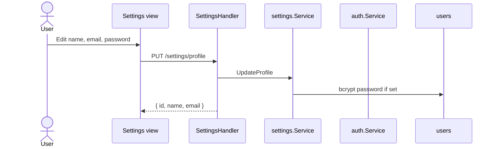

# Sequence: Settings

GoSite hanya mengimplementasikan **update profil user**. Modul PHP/FPM legacy tidak di-port.

## GoSite (implementasi)

### API

| Method | Path | Status |
|--------|------|--------|
| PUT | `/api/v1/settings/profile` | ✅ Implemented |

Profil user saat ini dibaca via `GET /auth/me`.

### Validasi

- Name & email required
- Password optional; jika diisi minimum 6 karakter
- bcrypt hash (compatible Laravel `$2y$` prefix)

---

## Legacy BangunSite (tidak di-port)

PHP ini, php-fpm, pool editor

| Legacy route | GoSite |
|--------------|--------|
| `POST /admin/setting/update/php` | ❌ Dropped — panel tanpa PHP |
| `POST /admin/setting/update/fpm` | ❌ Dropped |
| `POST /admin/setting/update/pool` | ❌ Dropped |

BangunSite legacy mengedit `/storage/php/*`. GoSite container tidak menjalankan PHP-FPM untuk panel.

## Kode

| File | Peran |
|------|-------|
| `internal/service/settings/service.go` | UpdateProfile |
| `internal/delivery/http/handler/settings.go` | HTTP |

UI hints: `GET /ui/meta` → section settings labels.
