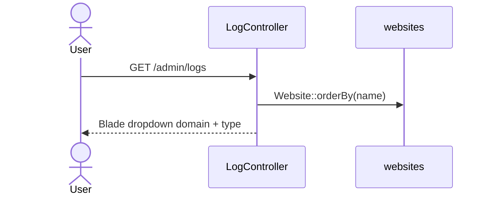
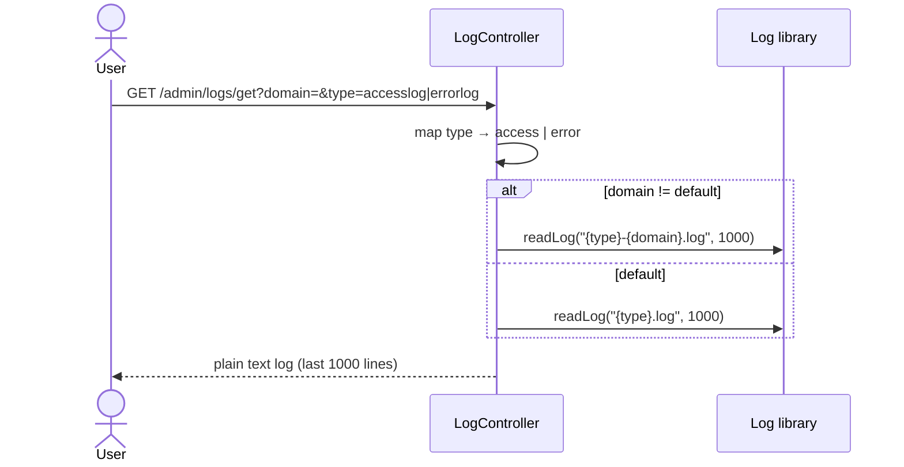

# Sequence: Log Viewer

Membaca log nginx access/error per domain atau global.

**Routes:** `GET /admin/logs`, `GET /admin/logs/get`

## List sites untuk filter



## Fetch log content



## Path log

| Log | Path |
|-----|------|
| Global access | `/storage/laravel/logs/access.log` |
| Global error | `/storage/laravel/logs/error.log` |
| Per domain access | `access-{domain}.log` |
| Per domain error | `error-{domain}.log` |

## Traffic parsing (dashboard)

`Log::accessTraffic()` — parse access log untuk statistik per site (dipakai API dashboard).

## Implikasi GoSite

```
GET /api/v1/logs/sites
GET /api/v1/logs?domain=default&type=access&tail=1000
```

Opsional:
- `GET /api/v1/logs/tail` — SSE follow mode
- Filter level, search regex

Frontend hanya render text/monospace — tidak ada preferensi framework.
