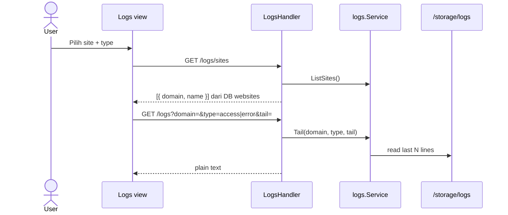

# Sequence: Log Viewer

Tail nginx access/error log per domain atau global.

## GoSite (implementasi)

**Paket:** `internal/service/logs`

### API

| Method | Path | Query |
|--------|------|-------|
| GET | `/logs/sites` | — |
| GET | `/logs` | `domain`, `type` (`access`\|`error`), `tail` (default 1000) |

### Path log

Format `main` dari `config/nginx/custom.d/nginx-log.conf`.

| domain | Access | Error |
|--------|--------|-------|
| `default` | `/storage/logs/access.log` | `/storage/logs/error.log` |
| `{domain}` | `access-{domain}.log` | `error-{domain}.log` |

### Integrasi observability

- **Splunk Lite** — ingest + query log events ([17-splunk-lite.md](./17-splunk-lite.md), [panduan pencarian log](../guides/log-search_id.md))
- **Grafana Lite** — aggregate traffic dari access log ([18-grafana-lite.md](./18-grafana-lite.md))
- **Metrik nginx** — stub_status + VTS poll localhost ([22-nginx-metrics_id.md](./22-nginx-metrics_id.md))
- **Dashboard fallback** — `GET /system/nginx-traffic` parse access log langsung

---

## Legacy BangunSite

GET /admin/logs/get

Sama konsep path; GoSite memakai REST + auth session.

## Kode

| File | Peran |
|------|-------|
| `internal/service/logs/service.go` | Tail, list sites |
| `internal/delivery/http/handler/logs.go` | HTTP |
