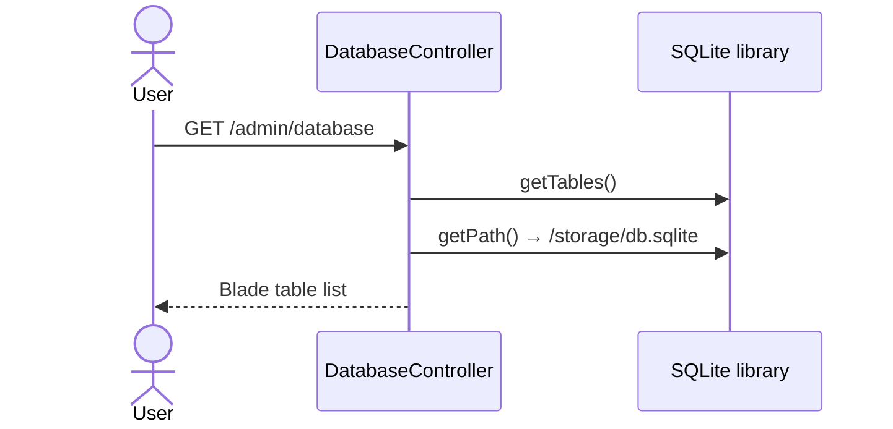
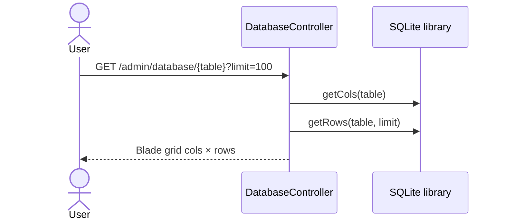

# Sequence: Database Viewer

Admin tool untuk melihat isi SQLite panel — **bukan** manajemen database server.

**Routes:** `/admin/database`

## List tables



## Show table rows



## Batasan

- Read-only di UI (tidak ada insert/update/delete dari viewer)
- Hanya SQLite file panel, bukan MariaDB produksi

## Implikasi GoSite

```
GET /api/v1/database/tables
GET /api/v1/database/tables/{name}?limit=100&offset=0
```

Pertimbangan:
- Batasi ke admin role
- Optional: nonaktifkan di produksi (`DB_VIEWER_ENABLED=false`)
- Pagination proper (legacy hanya limit)

Untuk migrasi: schema tetap SQLite atau evaluasi embed + migration tool (goose/golang-migrate).
