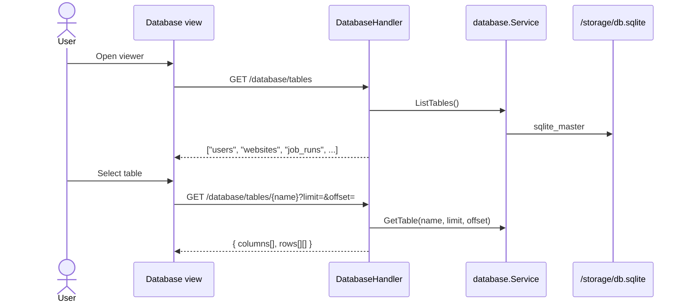

# Sequence: Database Viewer

Admin tool **read-only** for panel SQLite.

## GoSite (implementation)

**Package:** `internal/service/database`

### API

| Method | Path | Query |
|--------|------|-------|
| GET | `/database/tables` | — |
| GET | `/database/tables/{name}` | `limit`, `offset` |

### Batasan

- **Read-only** — no INSERT/UPDATE/DELETE from UI
- Hanya file `db.sqlite` panel
- Session + basic auth required
- Pagination via `limit` / `offset` (default limit 100)

### Schema relevan

| Table | Contents |
|-------|-----|
| `users` | Admin panel |
| `websites` | Vhost records |
| `cronjobs` | Scheduled commands |
| `job_runs` | Certbot, cron, manual runs |
| `sessions` | Auth sessions |
| `audit_logs` | Splunk Lite audit |
| `log_events` | Ingested nginx lines |
| `traffic_metrics` | Grafana Lite buckets |
| `nginx_status_samples` | stub_status time series ([22-nginx-metrics.md](./22-nginx-metrics.md)) |
| `nginx_vts_server_samples` | VTS per-server snapshots |
| `nginx_vts_upstream_samples` | VTS per-upstream peer snapshots |
| `saved_queries` | Splunk saved searches |

Migrasi: `migrations/*.sql` via `gosite migrate`.

---

## Legacy BangunSite

Blade grid viewer

Sama read-only; GoSite menambah offset pagination.

## Code

| File | Role |
|------|-------|
| `internal/service/database/service.go` | Query tables |
| `internal/repository/sqlite` | Schema + migrations |
